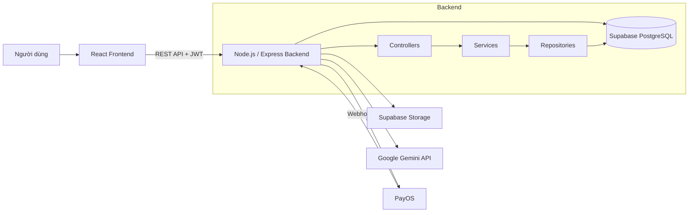
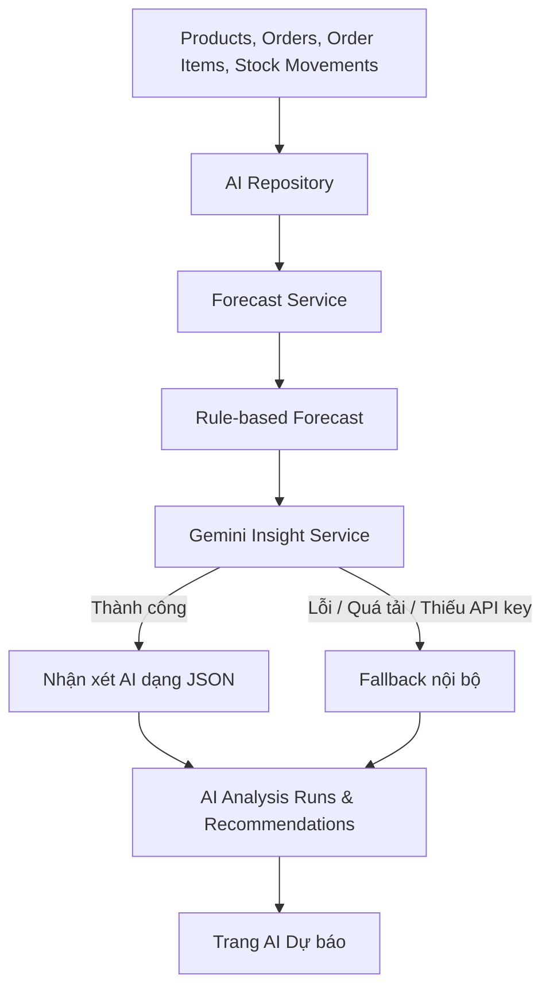

# Smart Retail Inventory AI

<p align="center">
  Hệ thống quản lý kho mini cho cửa hàng bán lẻ, tích hợp bán hàng, cảnh báo tồn kho, báo cáo và AI hỗ trợ dự báo nhu cầu nhập hàng.
</p>

<p align="center">
  
  
  
  
</p>

---

## Giới thiệu

**Smart Retail Inventory AI** là hệ thống web hỗ trợ cửa hàng bán lẻ quản lý sản phẩm, tồn kho, nhập/xuất hàng, đơn bán, cảnh báo, báo cáo và người dùng trên một nền tảng thống nhất.

Hệ thống hướng đến ba mục tiêu chính:

- Số hóa quy trình quản lý kho và bán hàng.
- Giảm sai sót khi theo dõi số lượng tồn, nhập kho và xuất kho.
- Hỗ trợ người quản lý ra quyết định nhập hàng dựa trên dữ liệu thực tế và dự báo.

Ngoài các chức năng nghiệp vụ truyền thống, hệ thống còn có module **AI Dự báo**. Module này sử dụng dữ liệu sản phẩm, đơn hàng, chi tiết đơn hàng và biến động kho để tính toán nhu cầu dự kiến, xác định mặt hàng có nguy cơ thiếu hụt và đề xuất số lượng cần nhập.

---

## Bài toán giải quyết

Các cửa hàng nhỏ thường quản lý hàng hóa bằng sổ sách hoặc nhiều file Excel riêng lẻ. Cách làm này dễ dẫn đến:

- Chênh lệch số lượng tồn kho.
- Khó truy vết lịch sử nhập và xuất hàng.
- Không phát hiện kịp sản phẩm sắp hết.
- Thiếu dữ liệu tổng hợp để đánh giá doanh thu.
- Nhập dư hoặc nhập thiếu do quyết định chủ yếu dựa trên cảm tính.
- Khó kiểm soát người dùng và quyền truy cập.

Smart Retail Inventory AI tập trung giải quyết các vấn đề trên bằng dữ liệu tập trung, quy trình rõ ràng, phân quyền người dùng và phân tích dự báo.

---

## Chức năng chính

### Tổng quan

- Thống kê tổng số sản phẩm và giá trị tồn kho.
- Theo dõi doanh thu, đơn hàng và hoạt động gần đây.
- Hiển thị sản phẩm bán chạy và sản phẩm cần nhập.
- Cung cấp thông tin nhanh phục vụ vận hành hằng ngày.

### Quản lý sản phẩm

- Quản lý sản phẩm, danh mục, đơn vị tính và nhà cung cấp.
- Tìm kiếm, lọc và phân trang.
- Thêm, sửa, xem chi tiết và xóa mềm.
- Upload ảnh sản phẩm.
- Theo dõi SKU, giá nhập, giá bán, tồn kho và mức đặt hàng lại.
- Nhập và xuất dữ liệu Excel.

### Nhập / Xuất kho

- Lập phiếu nhập kho theo nhà cung cấp.
- Lập phiếu xuất kho theo nhu cầu vận hành.
- Kiểm tra số lượng xuất không vượt quá tồn kho.
- Tự động cập nhật `stock_quantity`.
- Lưu lịch sử biến động trong `stock_movements`.

### Đơn bán hàng

- Tạo hóa đơn bán hàng tại quầy.
- Thêm nhiều sản phẩm và thay đổi số lượng.
- Tự động tính tổng tiền.
- Thanh toán tiền mặt hoặc chuyển khoản.
- Tích hợp QR PayOS và webhook xác nhận thanh toán.
- Lưu dữ liệu vào `orders` và `order_items`.
- Tự động trừ tồn kho sau khi đơn hàng hoàn tất.

### Cảnh báo tồn kho

- Phát hiện sản phẩm hết hàng hoặc sắp hết.
- So sánh tồn hiện tại với `reorder_level`.
- Lọc theo danh mục và trạng thái cảnh báo.
- Hỗ trợ chuyển nhanh sang quy trình nhập kho.

### Báo cáo

- Báo cáo doanh thu.
- Báo cáo tồn kho.
- Báo cáo sản phẩm bán chạy.
- Báo cáo lịch sử nhập hàng.
- Lọc theo khoảng thời gian, danh mục và nhà cung cấp.
- Xuất báo cáo Excel.

### AI Dự báo

- Đọc dữ liệu thật từ hệ thống.
- Phân tích lịch sử bán hàng theo khoảng thời gian cấu hình.
- Tính tốc độ bán trung bình.
- Dự báo nhu cầu trong số ngày được cấu hình.
- Ước tính số ngày tồn còn lại.
- Đề xuất số lượng cần nhập.
- Phân loại mức độ ưu tiên.
- Hiển thị nhận xét theo từng sản phẩm, danh mục và nhà cung cấp.
- Hoạt động theo cơ chế fallback: nếu dịch vụ AI bên ngoài không khả dụng, hệ thống vẫn trả dự báo nội bộ.

### Người dùng và phân quyền

Hệ thống hỗ trợ các vai trò:

- Quản trị viên.
- Chủ cửa hàng.
- Nhân viên kho.
- Nhân viên bán hàng.

Quyền truy cập được kiểm tra ở cả frontend và backend. Việc ẩn menu không thay thế cho kiểm tra quyền tại API.

### Cài đặt hệ thống

- Thông tin cửa hàng.
- Logo cửa hàng.
- Mức tồn tối thiểu mặc định.
- Cảnh báo tồn kho.
- Cấu hình AI và model.
- Thông tin tài khoản.
- Thanh toán PayOS.
- Bảo mật và đổi mật khẩu.

---

## Kiến trúc tổng quan



### Luồng AI



AI không được dùng để thay thế toàn bộ thuật toán nghiệp vụ. Các số liệu quan trọng được tính ở backend; model AI chủ yếu bổ sung nhận xét và diễn giải.

---

## Công nghệ

### Frontend

- React
- Vite
- Tailwind CSS
- Axios
- Lucide React
- Recharts
- React Router

### Backend

- Node.js
- Express.js
- JWT / Middleware xác thực
- Supabase JavaScript Client
- Google Generative AI SDK
- PayOS SDK
- Multer
- bcrypt / bcryptjs

### Dữ liệu và lưu trữ

- Supabase PostgreSQL
- Supabase Storage
- Supabase Realtime nếu được bật cho module thông báo

---

## Cấu trúc thư mục

```text
ĐATN_KHOHANGMINI/
├── backend/
│   ├── server.js
│   ├── package.json
│   └── src/
│       ├── config/
│       ├── controllers/
│       ├── middlewares/
│       ├── repositories/
│       ├── routes/
│       ├── services/
│       └── utils/
├── frontend/
│   ├── package.json
│   ├── vite.config.js
│   └── src/
│       ├── components/
│       ├── contexts/
│       ├── layouts/
│       ├── pages/
│       ├── routes/
│       ├── services/
│       └── utils/
├── database/
│   ├── schema.sql
│   ├── ai_schema.sql
│   └── seed/
├── spdd/
│   ├── analysis/
│   └── prompt/
├── AGENTS.md
├── README.md
└── .gitignore
```

Tên và vị trí một số file có thể thay đổi theo phiên bản hiện tại của dự án.

---

## Cơ sở dữ liệu

Các bảng nghiệp vụ chính:

| Bảng | Mục đích |
|---|---|
| `categories` | Danh mục sản phẩm |
| `units` | Đơn vị tính |
| `suppliers` | Nhà cung cấp |
| `products` | Sản phẩm và tồn kho |
| `orders` | Đơn bán hàng |
| `order_items` | Chi tiết đơn hàng |
| `stock_movements` | Lịch sử nhập, xuất và điều chỉnh kho |
| `users` hoặc `app_users` | Người dùng, vai trò và trạng thái |
| `settings` | Cấu hình hệ thống |
| `ai_analysis_runs` | Lịch sử các lần phân tích AI |
| `ai_recommendations` | Gợi ý nhập hàng theo sản phẩm |
| `notifications` | Thông báo hệ thống nếu module realtime được bật |
| `activity_logs` | Nhật ký thao tác nếu module audit được bật |

Sản phẩm sử dụng xóa mềm thông qua `deleted_at`. Các truy vấn nghiệp vụ cần loại bỏ bản ghi đã xóa mềm.

---

## Yêu cầu môi trường

- Node.js 18 trở lên.
- npm 9 trở lên.
- Một dự án Supabase.
- API key Gemini nếu sử dụng nhận xét AI.
- Tài khoản PayOS nếu sử dụng thanh toán QR.
- ngrok hoặc URL public khi kiểm thử webhook PayOS ở môi trường local.

---

## Cài đặt dự án

### 1. Clone repository

```bash
git clone <repository-url>
cd ĐATN_KHOHANGMINI
```

### 2. Cài đặt backend

```bash
cd backend
npm install
```

### 3. Cài đặt frontend

```bash
cd ../frontend
npm install
```

---

## Cấu hình biến môi trường

Không commit file `.env` lên Git.

### Backend

Tạo file:

```text
backend/.env
```

Ví dụ:

```env
PORT=5000
FRONTEND_URL=http://localhost:5173

SUPABASE_URL=https://your-project.supabase.co
SUPABASE_SERVICE_ROLE_KEY=your_service_role_key

JWT_SECRET=replace_with_a_long_random_secret
JWT_EXPIRES_IN=8h

GEMINI_API_KEY=your_gemini_api_key
GEMINI_MODEL=gemini-2.5-flash

PAYOS_CLIENT_ID=your_payos_client_id
PAYOS_API_KEY=your_payos_api_key
PAYOS_CHECKSUM_KEY=your_payos_checksum_key
PAYOS_RETURN_URL=http://localhost:5173/sales
PAYOS_CANCEL_URL=http://localhost:5173/sales
PAYOS_WEBHOOK_URL=https://your-public-url/api/payments/payos/webhook
```

### Frontend

Tạo file:

```text
frontend/.env
```

Ví dụ:

```env
VITE_API_BASE_URL=http://localhost:5000/api
VITE_SUPABASE_URL=https://your-project.supabase.co
VITE_SUPABASE_KEY=your_supabase_anon_key
```

`VITE_SUPABASE_KEY` phải là **anon/public key**, không dùng `SUPABASE_SERVICE_ROLE_KEY` ở frontend.

Sau khi thay đổi `.env`, cần dừng và chạy lại Vite.

---

## Khởi tạo cơ sở dữ liệu

Mở Supabase SQL Editor và chạy theo thứ tự:

```text
database/schema.sql
database/ai_schema.sql
```

Sau đó có thể import dữ liệu mẫu trong:

```text
database/seed/
```

Thứ tự import đề xuất:

1. `categories`
2. `units`
3. `suppliers`
4. `products`
5. `orders`
6. `order_items`
7. `stock_movements`

Kiểm tra lại khóa ngoại và kiểu dữ liệu trước khi import.

---

## Chạy dự án

### Chạy backend

```bash
cd backend
npm start
```

Hoặc nếu có script phát triển:

```bash
npm run dev
```

Backend mặc định:

```text
http://localhost:5000
```

### Chạy frontend

```bash
cd frontend
npm run dev
```

Frontend mặc định:

```text
http://localhost:5173
```

---

## API tiêu biểu

### Xác thực

```text
POST /api/auth/login
POST /api/auth/logout
GET  /api/auth/me
```

### Sản phẩm

```text
GET    /api/products
GET    /api/products/:id
POST   /api/products
PUT    /api/products/:id
DELETE /api/products/:id
```

### Nhập / Xuất kho

```text
GET  /api/inventory/movements
POST /api/inventory/import
POST /api/inventory/export
GET  /api/inventory/low-stock-alerts
```

### Đơn hàng

```text
GET  /api/orders
POST /api/orders
GET  /api/orders/:id
```

### Báo cáo

```text
GET /api/reports/revenue
GET /api/reports/inventory
GET /api/reports/top-selling
GET /api/reports/imports
GET /api/reports/export
```

### AI

```text
GET  /api/ai/settings
PUT  /api/ai/settings
POST /api/ai/test-connection
GET  /api/ai/forecast
POST /api/ai/analyze
GET  /api/ai/recommendations
POST /api/ai/recommendations/:id/apply
POST /api/ai/recommendations/:id/ignore
```

### Người dùng và cài đặt

```text
GET    /api/users
POST   /api/users
PUT    /api/users/:id
DELETE /api/users/:id
PATCH  /api/users/:id/status

GET  /api/settings
PUT  /api/settings
POST /api/settings/logo
```

Danh sách route thực tế cần được đối chiếu với thư mục `backend/src/routes`.

---

## Xác thực và phân quyền

Request tới API riêng tư phải gửi:

```http
Authorization: Bearer <access-token>
```

Nguyên tắc:

- `401 Unauthorized`: chưa đăng nhập, token sai hoặc token hết hạn.
- `403 Forbidden`: đã đăng nhập nhưng không đủ quyền.
- Backend không tin `role` do frontend gửi trong body hoặc query.
- Role được lấy từ token đã xác minh và/hoặc dữ liệu người dùng trong database.
- Webhook PayOS không dùng JWT người dùng; webhook phải được xác minh bằng checksum/chữ ký PayOS.

Ma trận quyền tham khảo:

| Chức năng | Admin | Chủ cửa hàng | Nhân viên kho | Nhân viên bán hàng |
|---|---:|---:|---:|---:|
| Dashboard đầy đủ | Có | Có | Giới hạn | Giới hạn |
| Sản phẩm | Toàn quyền | Toàn quyền | Xem/Thêm/Sửa | Xem |
| Nhập / Xuất kho | Có | Có | Có | Không |
| Đơn bán hàng | Có | Xem/Có | Không | Có |
| Cảnh báo tồn kho | Có | Có | Có | Xem giới hạn |
| Báo cáo tài chính | Có | Có | Không | Không |
| AI Dự báo | Có | Có | Xem | Không |
| Người dùng | Có | Giới hạn | Không | Không |
| Cài đặt hệ thống | Có | Giới hạn | Không | Không |

---

## Cách hoạt động của AI Dự báo

### Dự báo nội bộ

Backend tính toán từ dữ liệu thật:

```text
avg_daily_sales = sales_history / history_days

forecast_quantity = avg_daily_sales × forecast_days

required_stock = forecast_quantity + reorder_level

suggested_import_quantity =
max(0, required_stock - stock_quantity)
```

Các giá trị cần được giới hạn không âm và xử lý trường hợp thiếu dữ liệu bán hàng.

### Nhận xét AI

Gemini nhận dữ liệu đã được tổng hợp, không nhận toàn bộ database thô. Model trả về JSON có cấu trúc, gồm:

- Nhận xét tổng quan.
- Sản phẩm cần nhập gấp.
- Sản phẩm bán chạy.
- Sản phẩm bán chậm.
- Phân tích theo danh mục.
- Phân tích theo nhà cung cấp.
- Hành động đề xuất.

Số liệu tồn kho và dự báo phải lấy từ `ForecastService`; Gemini chỉ bổ sung phần diễn giải. Nếu Gemini lỗi, hết quota hoặc quá tải, hệ thống sử dụng báo cáo nội bộ.

---

## Thanh toán PayOS

Khi chạy local, webhook cần một URL public:

```bash
ngrok http 5000
```

Cấu hình webhook:

```text
https://your-ngrok-domain/api/payments/payos/webhook
```

Lưu ý:

- Backend phải đang chạy.
- URL webhook phải dùng HTTPS.
- Không dùng `localhost` làm webhook từ PayOS.
- Luôn xác minh checksum/chữ ký.
- Không ghi API key PayOS vào frontend.

---

## Kiểm thử nhanh

### Kiểm tra backend

```bash
curl http://localhost:5000/api/health
```

### Kiểm tra đăng nhập

```bash
curl -X POST http://localhost:5000/api/auth/login   -H "Content-Type: application/json"   -d "{\"email\":\"your-email\",\"password\":\"your-password\"}"
```

### Kiểm tra API riêng tư

```bash
curl http://localhost:5000/api/products   -H "Authorization: Bearer <token>"
```

Kết quả mong muốn:

- Không token: `401`.
- Token hợp lệ nhưng không đủ quyền: `403`.
- Token hợp lệ và đúng quyền: `200`.

### Build frontend

```bash
cd frontend
npm run build
```

---

## Quy ước phát triển

- Không hard-code API key, token hoặc mật khẩu.
- Không sử dụng `localStorage.clear()` nếu có dữ liệu không liên quan.
- Không lưu mật khẩu dạng văn bản thường.
- Không dùng `alert()` hoặc `confirm()` mặc định.
- Không dùng dữ liệu mock nếu API thật đã sẵn sàng.
- Không tin role hoặc user ID do client tự gửi.
- Ưu tiên xóa mềm cho dữ liệu nghiệp vụ.
- API cần trả JSON thống nhất.
- Các thao tác xóa, nhập kho, xuất kho, thanh toán và đổi quyền phải có xác nhận.
- Icon giao diện sử dụng `lucide-react`.
- Frontend phải xử lý riêng `401` và `403`.
- Không để một lỗi API tạo nhiều toast trùng lặp.

---

## Xử lý lỗi thường gặp

### Màn hình trắng và lỗi Supabase URL

```text
Missing VITE_SUPABASE_URL or VITE_SUPABASE_KEY
supabaseUrl is required
```

Kiểm tra `frontend/.env`, sau đó khởi động lại Vite.

### API trả 401

Kiểm tra:

- Người dùng đã đăng nhập hay chưa.
- Token có được lưu đúng field hay không.
- Request có header `Authorization: Bearer ...` hay không.
- Service có dùng chung Axios instance hay không.
- JWT secret lúc tạo và verify token có giống nhau không.

### API đăng nhập trả 404

Kiểm tra backend đã mount:

```text
app.use('/api/auth', authRoutes)
```

và route:

```text
POST /login
```

### Gemini trả 503

Đây có thể là trạng thái quá tải tạm thời. Hệ thống phải fallback sang dự báo nội bộ và không làm UI bị treo.

### Chart cảnh báo width/height âm

Đảm bảo `ResponsiveContainer` nằm trong phần tử có chiều cao xác định, ví dụ:

```jsx
<div className="w-full min-w-0 h-72">
  <ResponsiveContainer width="100%" height="100%">
    {/* chart */}
  </ResponsiveContainer>
</div>
```

### Import icon bị trùng

Nếu Vite báo:

```text
Identifier has already been declared
```

kiểm tra import icon trong component và chỉ giữ một khai báo.

---

## Trạng thái dự án

Các module lõi đã được triển khai và đang tiếp tục hoàn thiện:

- Dashboard.
- Sản phẩm và dữ liệu nền.
- Nhập / Xuất kho.
- Đơn bán hàng.
- Cảnh báo tồn kho.
- Báo cáo.
- AI Dự báo.
- Người dùng.
- Cài đặt.
- Đăng nhập, đăng xuất và phân quyền API.
- Thông báo realtime và nhật ký hoạt động đang được hoàn thiện theo Sprint.

---

## Phạm vi sử dụng

Dự án được xây dựng phục vụ mục đích học tập, nghiên cứu và đồ án tốt nghiệp. Trước khi triển khai cho môi trường thực tế cần bổ sung:

- Kiểm thử bảo mật.
- Sao lưu và khôi phục dữ liệu.
- Giám sát lỗi và logging tập trung.
- Rate limiting.
- Chính sách mật khẩu và refresh token.
- Kiểm thử tải.
- Quy trình CI/CD.
- Cấu hình production cho CORS, cookie và webhook.
- Chính sách quyền truy cập Supabase/RLS phù hợp.

---

## Kết luận

Smart Retail Inventory AI hướng tới một hệ thống quản lý kho thực tế, dễ sử dụng và có khả năng mở rộng. Sự kết hợp giữa quản lý sản phẩm, nhập/xuất kho, bán hàng, báo cáo, phân quyền và AI dự báo giúp cửa hàng theo dõi hoạt động tập trung, phát hiện rủi ro tồn kho sớm và đưa ra quyết định nhập hàng có cơ sở hơn.
