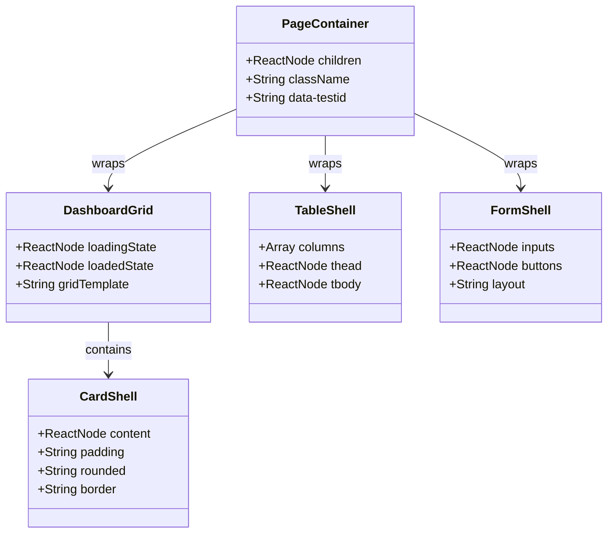

# [Refactor] Frontend Skeleton Layout Parity

## Requirements
Refactor frontend skeleton loading across all pages to achieve absolute layout parity (Shared Layout, Different Content), eliminating layout shifts by reusing structural containers between loading and loaded states.

## Entities

## Approach
1. Structural Refactoring Strategy:
   - Abandon independent Page Skeleton files (e.g., `ProductSkeleton.jsx` with isolated DOM).
   - Adopt "Shared Layout, Different Content" pattern: The CSS grid, layout wrappers, and main structural containers (PageContainer, CardShell, TableShell) must be identical and shared between `loading` and `loaded` states.
   - Inject the primitive `Skeleton` elements solely at the leaf nodes (content level) instead of wrapping the entire page.

2. Component-Level Loading Execution:
   - Extract fixed layouts (like `grid-cols-4` for stat cards) into shared wrappers.
   - Use ternary operators inside these shared wrappers to switch between `Skeleton` arrays and `Data` arrays (e.g., `{loading ? skeletons : data}`).
   - Ensure the routing `Suspense` fallback uses a minimal or transparent loader to let the actual Page Component handle its structural skeleton, preventing multi-stage layout shifts.

3. Automated Layout Validation:
   - Construct robust Playwright E2E tests (`skeleton-parity.spec.js`) covering all 14 pages across 5 viewport breakpoints (375px to 1920px).
   - Intercept API responses with a 1500ms delay to capture the precise Bounding Box of the structural containers during the `loading` phase, then capture the `loaded` phase Bounding Box after data resolves.
   - Assert `|width diff| <= 2px` and `|x diff| <= 2px` for zero horizontal layout shift.

## Structure

### Inheritance Relationships
1. `PageContainer` acts as the root structural shell for all main pages.
2. `CardShell`, `TableShell`, and `GridShell` act as the structural wrappers for internal sections.

### Dependencies
1. Page Components (`DashboardPage`, `ProductDashboard`, etc.) depend on `PageContainer` and `shadcn/ui Skeleton`.
2. Playwright E2E tests depend on `data-testid` injected into shared structural shells.

### Layered Architecture
1. Layout Layer: `PageContainer`, `MainLayout` (Source of truth for width/padding).
2. Structural Shell Layer: Shared grids, card wrappers, table wrappers.
3. Content Layer: Real Data Elements OR Skeleton Elements (shadcn/ui primitives).

## Operations

### Refactor Dashboard Module
1. Responsibility: Align Dashboard skeleton with its loaded state.
2. Attributes:
   - `data-testid="dashboard-stats"`
   - `data-testid="dashboard-main-grid"`
3. Methods:
   - Remove standalone `DashboardSkeleton.jsx` if it duplicates grid logic.
   - Implement shared wrapper for 4 StatCards, Revenue Chart, and AI Insights.
4. Constraints: Must maintain exact grid template (`grid-cols-4`, etc.).

### Refactor Products Module
1. Responsibility: Align Products skeleton with loaded state.
2. Attributes:
   - `data-testid="products-stats"`
   - `data-testid="products-filter"`
   - `data-testid="products-table"`
3. Methods:
   - Implement shared wrapper for StatCards.
   - Preserve Filter container height and flex properties.
   - Implement shared `TableShell` with exact column widths for both loading rows and loaded rows.

### Refactor Inventory Module
1. Responsibility: Fix severe layout divergence in Inventory Ops Dashboard.
2. Attributes:
   - `data-testid="inventory-main-grid"`
   - `data-testid="inventory-form"`
   - `data-testid="inventory-history"`
3. Methods:
   - Reuse the exact `grid-cols-[minmax(0,2fr)_minmax(320px,0.9fr)]` class.
   - Form section must mock exact input blocks.
   - History section must match precise height and padding.

### Refactor Remaining Modules
1. Responsibility: Apply Shared Layout pattern to Sales, AI, Reports, Activity Logs, Users, Categories, Units, Suppliers, Settings.
2. Methods:
   - Audit each page's loaded grid.
   - Inline the `isLoading` state inside the true CSS wrappers.
   - Retain static UI (Page Title, static buttons) during loading state.

### Implement Layout Shift E2E Tests
1. Responsibility: Verify layout parity automatically via Playwright.
2. Logic:
   - `page.route('**/api/**', ...)` with 1500ms delay.
   - Wait for `data-testid` skeleton.
   - Extract `.boundingBox()`.
   - Release route.
   - Wait for `data-testid` loaded.
   - Extract `.boundingBox()`.
   - Assert `Math.abs(loading.width - loaded.width) <= 2`.

## Norms
1. **Single Source of Truth**: Layout dimensions (CSS grids, flex, padding, height) must be defined exactly ONCE per section, shared by both skeleton and loaded states.
2. **Skeleton Constraints**: Skeletons must NOT declare fixed `width` or `max-width` that overrides parent constraints. Use `w-full` and `h-[...]` for structural sizing.
3. **Static Content Priority**: Do not skeletonize static labels, titles, or action buttons unless they depend on dynamic data.
4. **Data-TestId Standards**: Every major layout section must have a stable `data-testid` for reliable bounding box capture.

## Safeguards
1. **Functional Constraints**: Layout shifting (X-axis, width) during data hydration must not exceed 2px.
2. **Technical Constraints**: No standalone PageSkeleton files (`<GenericPageSkeleton />`) should be used if they duplicate or mock page structure independently.
3. **Responsive Constraints**: Skeletons must correctly reflect the layout at 375px, 430px, 768px, 1366px, and 1920px.
4. **Data Constraints**: The variability in data length (e.g., number of rows in a table) must not alter the horizontal grid templates or page max-width.
5. **Component Constraints**: MainLayout sidebar state must be initialized synchronously prior to render to prevent initial page shell shifting.
