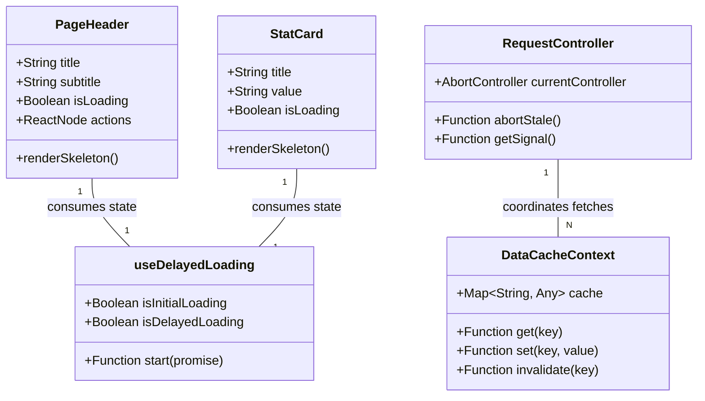

# [Refactor] Full-Page Skeleton & Performance Optimization

## Requirements
Implement perfect 1:1 structural layout parity between loading and loaded states across all route contents using Shadcn primitives, while optimizing data loading performance through request parallelization, deduplication, caching, and dynamic bundle splitting.

## Entities

## Approach
1. **Layout Strategy**:
   - Adopt an "Inline Conditional Rendering" strategy where existing structural components (`PageHeader`, `StatCard`, Tabs, Table wrappers) accept an `isLoading` prop and render their own skeleton primitives perfectly matching their loaded dimensions.
   - Maintain the `MainLayout` App Shell (Sidebar, Topbar) as fully rendered during route transitions.

2. **Loading Optimization Strategy**:
   - Implement `useDelayedLoading` hook to suppress skeletons for responses <120ms and enforce a minimum 250ms display duration to eliminate flashing.
   - Introduce a lightweight `MasterDataContext` to cache immutable reference data (`Categories`, `Units`, `Suppliers`) across route changes, invalidating only on mutations.

3. **Network Resilience & Bundle Strategy**:
   - Wire `AbortController` into debounced search/filter hooks to cancel stale HTTP requests.
   - Group independent data fetching calls in `Promise.all` blocks to maximize parallelization.
   - Abstract `exceljs` export logic into dynamically imported modules (`await import('exceljs')`) to strip it from the initial application bundle.

## Structure

### Dependencies
1. All page components (`DashboardPage`, `ProductDashboard`, etc.) inject `useDelayedLoading`.
2. Master data dropdowns and forms inject `useMasterData` context.
3. Search inputs utilize `useDebounce` hook.
4. API Service layer accepts `AbortSignal` for request cancellation.

### Layered Architecture
1. **Component Layer**: Passes `isLoading` flags downward; renders Shadcn `<Skeleton>` in place of actual text/controls.
2. **Custom Hooks Layer**: Orchestrates debouncing, delay thresholding, and cache retrievals.
3. **Context Layer**: Persists `Categories`, `Units`, `Suppliers` in memory.
4. **Service Layer**: Manages `AbortController` generation and network executions.

## Operations

### Implement Core Hooks & Contexts
1. **Create Hook**: `frontend/src/hooks/useDelayedLoading.js`
   - Implement logic using `setTimeout` to flip a `shouldShowSkeleton` boolean only if the incoming `isLoading` state remains true for >120ms.
   - Ensure the boolean stays true for a minimum of 250ms once activated.

2. **Create Hook**: `frontend/src/hooks/useDebounce.js`
   - Implement standard `useEffect` timeout logic (300ms) to return a debounced value.

3. **Create Context**: `frontend/src/contexts/MasterDataContext.jsx`
   - Create a React Context wrapping the app.
   - State: `{ categories, units, suppliers, isLoaded }`.
   - Implement `fetchCategories`, `fetchUnits`, `fetchSuppliers` ensuring they only hit the API if data is absent or an explicit `forceRefresh` flag is passed.

### Refactor Shared Structural Components
1. **Update**: `frontend/src/components/PageHeader.jsx`
   - Accept `loading` prop.
   - If `loading` is true, render a `<Skeleton className="h-8 w-64" />` for the title and a similarly styled skeleton for the subtitle.
   - Map over the `actions` (buttons) and render `Skeleton` blocks matching the button dimensions.

2. **Update**: `frontend/src/components/StatCard.jsx`
   - Accept `loading` prop.
   - If `loading`, render `Skeleton` primitives for the title, value, and icon areas while maintaining the exact padding and card height.

3. **Update**: Shared Table/Filter Layouts
   - Ensure filter inputs and view toggles gracefully downgrade to skeleton blocks matching their exact widths when `loading` is true.

### Refactor Data Fetching in Pages
1. **Update**: `frontend/src/components/ProductDashboard.jsx` (and similar heavy pages)
   - Replace sequential `await fetchProducts()`, `await fetchStats()` with `Promise.all([fetchProducts(), fetchStats()])`.
   - Replace local master data fetching with `useMasterData()` hook.
   - Wire the search input through `useDebounce`.
   - Implement `AbortController` in the `fetchProducts` API call to cancel stale requests when the debounced search changes.

2. **Update**: `frontend/src/pages/DashboardPage.jsx`
   - Ensure the overview request groups multiple data points into a single optimized backend call (if available) or uses `Promise.all`.
   - Prevent duplicate polling intervals from surviving unmounts.

### Optimize Bundles
1. **Update**: Excel Export Logic
   - Locate where `exceljs` and `file-saver` are imported.
   - Refactor static imports to dynamic imports inside the click handler: `const ExcelJS = (await import('exceljs')).default;`.
   - Show an inline spinner on the export button while the chunk loads.

## Norms
1. **Skeleton Usage**: Strictly use `@/components/ui/skeleton` (`Skeleton` component). Do not write custom CSS animations.
2. **Parallel Fetching**: Always use `Promise.all` for independent data requirements in `useEffect` blocks.
3. **No Mixed Content**: A single container must either be entirely skeletonized or entirely populated. Do not mix real text headers with skeletonized table rows during initial load.
4. **Console Monitoring**: Utilize `console.time` and `console.timeEnd` during development to verify the 120ms threshold and parallel fetch improvements.

## Safeguards
1. **Visual Parity**: The `clientWidth` and `clientHeight` of the main container during the loading state must be within 2px of the loaded state.
2. **Stale Data Prevention**: All fast-firing API calls (search, filter) MUST supply an `AbortSignal` to the axios instance.
3. **No Infinite Loading**: All `useEffect` data fetching wrappers must contain a `finally { setLoading(false) }` block.
4. **App Shell Integrity**: Skeletons must strictly be confined to the Route Content area. The Sidebar and Topbar must never enter a skeleton state during client-side navigation.
