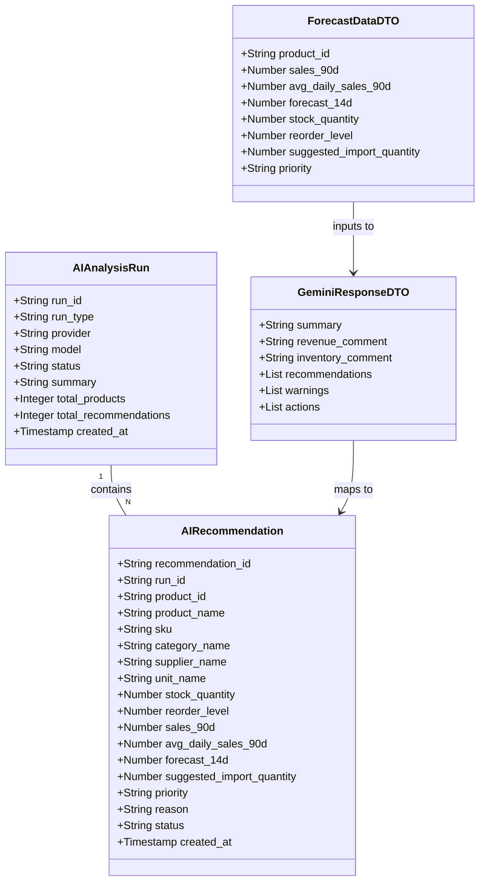

# AI Inventory Forecast Module

## Requirements
Implement an AI-driven inventory forecasting module that aggregates historical sales and stock data from Supabase, calculates a rule-based baseline forecast, and securely invokes the Google Gemini API to generate intelligent import recommendations (with graceful rule-based fallback), while providing a synchronized, interactive UI for merchants to review and apply suggestions.

## Entities


## Approach
1. Data Processing Pipeline:
   - Aggregation: Fetch active products, 90-day completed orders, and recent stock movements via `AIRepository`. Ensure missing sales history results in a `0` forecast rather than errors.
   - Baseline Calculation: `ForecastService` will compute mathematical baseline metrics (`avg_daily_sales_90d`, `forecast_14d`, `suggested_import_quantity`) ensuring system functionality even without AI.
   - AI Augmentation: `GeminiAIService` receives the cleaned, aggregated baseline data, using a strict System Prompt to enforce JSON output. 

2. Technical Implementation:
   - Use Node.js `axios` or `@google/generative-ai` to interact with Gemini.
   - Ensure the API key (`GEMINI_API_KEY`) is read solely from the backend `.env` file and is never leaked.
   - Save the analysis result transactionally (or sequentially) into `ai_analysis_runs` and `ai_recommendations` in Supabase to cache the state and allow UI actions (APPLY/IGNORE).

3. Business Logic:
   - Rule-based Fallback: If Gemini times out, hits rate limits, or returns invalid JSON, the system must catch the error and fallback to saving recommendations based solely on `ForecastService` output.
   - Recommendation Lifecycle: Created as `PENDING`, transitioning to `APPLIED` (when user accepts and creates an import order) or `IGNORED`.

## Structure

### Dependencies
1. `AIController` injects `AIInsightService` and `SettingService`.
2. `AIInsightService` injects `AIRepository`, `ForecastService`, and `GeminiAIService`.
3. `GeminiAIService` calls external Google API.

### Layered Architecture
1. Controller Layer (`AIController`): Exposes REST endpoints for triggering analysis, fetching recommendations, and applying them.
2. Service Layer (`AIInsightService`, `ForecastService`, `GeminiAIService`): Orchestrates the pipeline, handles mathematics, and interacts with LLMs.
3. Repository Layer (`AIRepository`): Executes complex Supabase queries to aggregate data.
4. Database Layer: Stores cached AI insights.

## Operations

### Create Database Schema - Migration
1. Responsibility: Prepare Supabase for AI insights storage.
2. Methods:
   - Run raw SQL to create `ai_analysis_runs` and `ai_recommendations` tables as defined in the schema.

### Create Repository - AIRepository
1. Responsibility: Fetch and aggregate historical data.
2. Methods:
   - `getForecastBaseData()`: Returns Array of raw product and sales data.
     - Logic: Query `products` where `deleted_at IS NULL`. Query `orders` (completed) and `order_items` for the last 90 days. Aggregate sales per product.

### Create Service - ForecastService
1. Responsibility: Rule-based mathematical forecasting.
2. Methods:
   - `calculateBaseline(rawProducts)`: Returns Array of `ForecastDataDTO`.
     - Logic: 
       - `avg_daily_sales_90d = sales_90d / 90`
       - `forecast_14d = avg_daily_sales_90d * 14`
       - `required_stock = forecast_14d + reorder_level`
       - `suggested_import_quantity = max(0, required_stock - stock_quantity)`
       - Set `priority` (Cao/Trung bình/Thấp) based on stock levels.

### Create Service - GeminiAIService
1. Responsibility: Connect to Google Gemini API securely.
2. Methods:
   - `analyzeInventory(baselineData)`: Returns `GeminiResponseDTO`.
     - Logic: Send a strict system prompt instructing Gemini to act as a retail assistant and return JSON. Pass the top 100 products from `baselineData` as context.
     - Error Handling: Try-catch block. Strip ```json markdown wrappers using regex before parsing. Throw custom error if failed to allow fallback.

### Create Service - AIInsightService
1. Responsibility: Orchestrate the entire flow and save to DB.
2. Methods:
   - `runAnalysis()`: 
     - Logic: Get data from `AIRepository`, calculate baseline via `ForecastService`. If Settings enable AI, call `GeminiAIService`. If Gemini fails, construct a `GeminiResponseDTO` mockup using baseline data. Insert into `ai_analysis_runs` and `ai_recommendations`.
   - `getLatestRecommendations()`: Fetch from DB.
   - `updateRecommendationStatus(id, status)`: Update DB row.

### Create Controller - AIController
1. Responsibility: Expose HTTP endpoints.
2. Methods:
   - `GET /api/ai/forecast`: Returns rule-based forecast.
   - `POST /api/ai/analyze`: Triggers `AIInsightService.runAnalysis()`.
   - `GET /api/ai/recommendations`: Fetches latest stored insights.
   - `POST /api/ai/recommendations/:id/apply`: Updates status.
   - `POST /api/ai/test-connection`: Verifies API key presence.

### Update Frontend - AIInsightsPage & aiService
1. Responsibility: Connect UI to new endpoints.
2. Logic:
   - Replace dummy data in `AIInsightsPage` with calls to `aiService.getAIRecommendations()`.
   - Handle the "Phân tích mới" button by calling `aiService.runAIAnalysis()` and showing a loading toast.
   - On "APPLY", call `aiService.applyAIRecommendation(id)` and navigate to Inventory Ops page with query params.

### Update Frontend - SettingsPage
1. Responsibility: Wire AI tab settings.
2. Logic: Ensure AI Model, Forecast Days, and API Connection tests interact correctly with the backend.

## Norms
1. JSON Parsing: Always use `const cleanJson = response.replace(/```json/g, '').replace(/```/g, '').trim(); JSON.parse(cleanJson);` when dealing with LLM outputs.
2. Error Handling: Backend errors must be caught by `GlobalExceptionHandler`.
3. Validation: Controller must validate path parameters before hitting services.

## Safeguards
1. Security Constraints: `GEMINI_API_KEY` MUST NOT be returned in any API response or logged to the console.
2. Payload Constraints: Limit the number of products sent to Gemini in a single prompt (e.g., Top 100) to avoid exceeding context windows or token limits.
3. Fallback Constraints: If the AI API fails (timeout, 500, parsing error), the application MUST NOT crash. It MUST gracefully fall back to the `ForecastService` mathematical logic and inform the user via a frontend toast.
4. Data Integrity: `suggested_import_quantity` must never be less than 0.
