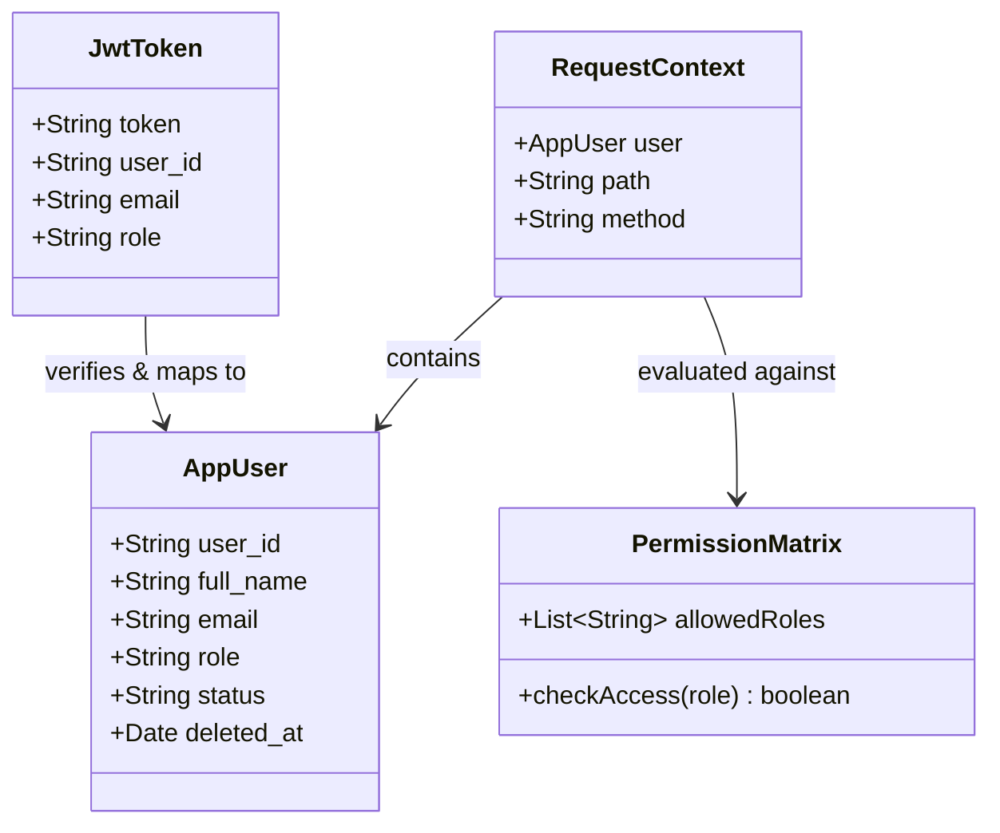

# API Role-Based Authentication and Authorization

## Requirements
Implement robust, multi-layered security for all backend APIs using JWT and real-time database validation to prevent unauthorized access.
Design and integrate a role-based access control (RBAC) authorization middleware to restrict API usage based on a defined Permission Matrix.
Ensure public endpoints (such as login and PayOS webhooks) remain accessible without JWT authentication while protecting all internal routes.
Standardize error responses for authentication (401) and authorization (403) failures to improve security and client handling.

## Entities

## Approach
1. Authentication Layer (authMiddleware):
   - Upgrade the existing JWT middleware to extract the token, verify its signature, and extract the `user_id`.
   - Query the `app_users` table in real-time to verify the user exists, `deleted_at` is null, and `status` is 'Đang hoạt động'.
   - Attach the full user object to `req.user` for downstream use.
   - Return 401 Unauthorized for missing tokens, expired tokens, or invalid/locked users.

2. Authorization Layer (authorizeRoles):
   - Create a new factory middleware `authorizeRoles(...allowedRoles)` that checks if `req.user.role` is in the `allowedRoles` array.
   - Return 403 Forbidden if the user's role is not permitted to access the route.
   - Define a consistent Permission Matrix aligned with business rules.

3. Route Integration:
   - Apply `authMiddleware` to all protected routes in their respective router files (e.g., `productRoutes.js`, `orderRoutes.js`).
   - Exclude public routes like `/api/auth/login` and `/api/payments/payos-webhook` from `authMiddleware`.
   - Apply `authorizeRoles` to specific endpoints or router groups based on the Permission Matrix.

4. Error Handling:
   - Do not leak stack traces or internal secrets in 401/403 responses.
   - Format: `{ "success": false, "message": "..." }`.

## Structure

### Dependencies
1. All protected `*Routes.js` files depend on `authMiddleware`.
2. Specific protected routes depend on `authorizeRoles` middleware.
3. `authMiddleware` depends on `jsonwebtoken` and `UserRepository`.

### Layered Architecture
1. Middleware Layer: Intercepts requests, validates JWT, fetches real-time DB user status, and checks role permissions.
2. Route Layer: Groups endpoints and applies the appropriate authentication and authorization middleware.
3. Controller Layer: Assumes `req.user` is fully validated and authorized.

## Operations

### Update Middleware - authMiddleware
1. Responsibility: Validate JWT and check user status in real-time against the database.
2. Methods:
   - `authMiddleware(req, res, next)`: `void`
     - Logic:
       - Extract token from `Authorization` header. If missing, return 401 (Bạn chưa đăng nhập hoặc token không hợp lệ).
       - Verify token using `jsonwebtoken` and `JWT_SECRET`. If invalid/expired, return 401 (Phiên đăng nhập hết hạn hoặc không hợp lệ).
       - Use `UserRepository.findById(decoded.user_id)` to fetch the user.
       - If user not found, return 401 (Người dùng không tồn tại).
       - If user `deleted_at` is not null or `status` !== 'Đang hoạt động', return 401 (Tài khoản của bạn đã bị khoá hoặc ngưng hoạt động).
       - Assign fetched user to `req.user`.
       - Call `next()`.

### Create Middleware - authorizeRoles
1. Responsibility: Restrict access based on user role.
2. Methods:
   - `authorizeRoles(...allowedRoles)`: `Function(req, res, next)`
     - Logic:
       - Return a middleware function.
       - Inside the function, check if `req.user` exists. If not, return 401.
       - Check if `allowedRoles.includes(req.user.role)`.
       - If false, return 403 (Bạn không có quyền thực hiện thao tác này).
       - If true, call `next()`.

### Apply Middleware - Route Configurations
1. Responsibility: Apply the security middlewares to all relevant backend routers.
2. Logic:
   - Define constant role groups for convenience:
     - `const ADMIN_OWNER = ['Quản trị viên', 'Chủ cửa hàng'];`
     - `const WAREHOUSE = ['Nhân viên kho'];`
     - `const SALES = ['Nhân viên bán hàng'];`
   - **User & Settings Routes** (`userRoutes.js`, `settingRoutes.js`, `aiRoutes.js`):
     - Apply `authMiddleware`.
     - Apply `authorizeRoles('Quản trị viên', 'Chủ cửa hàng')` to all endpoints.
   - **Product, Category, Unit, Supplier, Inventory Routes**:
     - Apply `authMiddleware`.
     - Allow GET/POST/PUT/DELETE for Admin, Owner, Warehouse.
     - Allow only GET for Sales (e.g., `router.get('/', authMiddleware, authorizeRoles(...ADMIN_OWNER, ...WAREHOUSE, ...SALES), ...)`).
   - **Order Routes**:
     - Apply `authMiddleware`.
     - Allow GET/POST/PUT for Admin, Owner, Sales.
     - Allow only GET for Warehouse, or deny (based on business choice: deny POST/PUT/DELETE for Warehouse).
   - **Dashboard & Report Routes**:
     - Apply `authMiddleware`.
     - Allow all authenticated users (or restrict based on specific report types).
   - **Payment Routes** (`paymentRoutes.js`):
     - Exclude `/payos-webhook` from `authMiddleware` entirely.
     - Apply `authMiddleware` to internal payment queries.

## Norms
1. Authentication: Always extract role from the validated database record, never trust the client payload.
2. Middleware Chaining: Always place `authMiddleware` before `authorizeRoles` in the route definition.
3. Security: Never log raw JWTs or user passwords.
4. Error Responses: Return standard `{ success: false, message: string }` without leaking internal DB errors.

## Safeguards
1. Functional Constraints: `authMiddleware` must hit the database to catch immediately locked accounts, overriding the 7-day token lifespan.
2. Security Constraints: Webhooks must be isolated from user JWT authentication.
3. API Constraints: The `req.user` object must be guaranteed to be populated for any controller method behind `authMiddleware`.
4. Exception Handling Constraints: GlobalExceptionHandler should not override the specific 401/403 responses sent by these middlewares.
