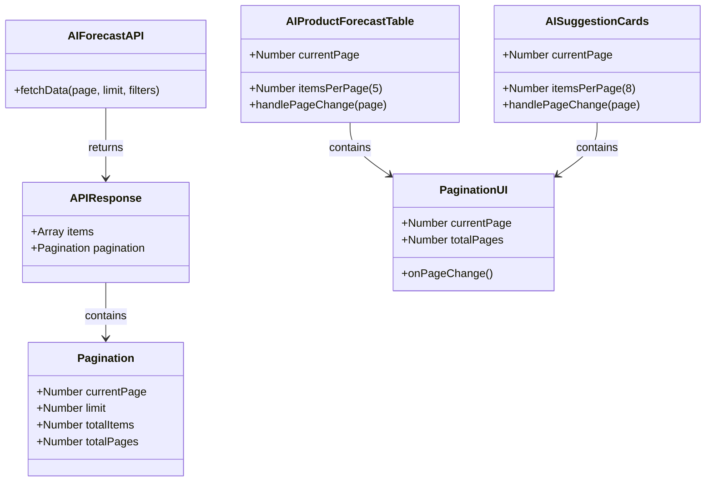

# Bổ sung tính năng phân trang cho trang AI Dự báo

## Requirements
Bổ sung tính năng phân trang (pagination) dạng server-side cho bảng "Dự báo nhu cầu từng sản phẩm" (5 dòng/trang) và lưới "Gợi ý nhập hàng từ AI" (8 thẻ/trang). Các phân trang hoạt động độc lập, không ảnh hưởng lẫn nhau và phải bảo toàn nguyên vẹn tính năng tìm kiếm, lọc (filter), chức năng áp dụng AI của giao diện cũ.

## Entities

## Approach
1. **Hình thức phân trang**:
   - Server-side pagination.
2. **Luồng xử lý**:
   - Mỗi khi người dùng tương tác chuyển trang trên `PaginationUI` (hoặc thay đổi bộ lọc), Frontend sẽ set lại state `currentPage` và kích hoạt gọi lại API gửi kèm các query params (VD: `?page=1&limit=5` đối với bảng và `?page=1&limit=8` đối với thẻ gợi ý) cùng các tham số lọc lên Backend.
   - Backend chịu trách nhiệm tính toán tổng số bản ghi (`totalItems`), tổng số trang (`totalPages`) dựa trên `limit` và trả về một object `pagination` kèm với mảng `items`.
3. **Render Dữ liệu**:
   - Các component `AISuggestionCards` và `AIProductForecastTable` sẽ render trực tiếp data nhận được từ API thay vì tự slice (cắt) dữ liệu trong bộ nhớ như trước đây.
   - Trong quá trình đợi API trả về, cần hiển thị Loading state để tránh tình trạng màn hình bị "đơ" hoặc giật lag.

## Structure
### Dependencies
- Sửa đổi các hàm gọi API ở Frontend (thêm params `page` và `limit`).
- Do bảng và lưới thẻ phân trang hoàn toàn độc lập, nên tách logic thành 2 lời gọi API độc lập hoặc Backend phải trả về cấu trúc chia làm 2 list riêng kèm theo pagination của từng list.
- Cập nhật giao diện nội bộ tại `AIProductForecastTable.jsx` và `AISuggestionCards.jsx` để nhận object `pagination` từ API.

## Operations

### Update Component - AIProductForecastTable.jsx
1. **Responsibility**: Áp dụng phân trang server-side cho bảng dự báo sản phẩm (limit=5).
2. **Logic**:
   - Khởi tạo state: `const [currentPage, setCurrentPage] = useState(1);`
   - Gọi lại hàm fetch data (truyền lên `page={currentPage}` và `limit=5`) mỗi khi `currentPage` hoặc các bộ lọc (`searchTerm`, `selectedCategory`, `selectedRisk`) thay đổi.
   - Reset `setCurrentPage(1)` khi các giá trị tìm kiếm/lọc thay đổi.
   - **Hiển thị**: Render trực tiếp mảng `items` lấy từ Backend.
   - **Giao diện**: Truyền `pagination.totalPages` từ Backend vào UI thanh điều hướng chuyển trang.

### Update Component - AISuggestionCards.jsx
1. **Responsibility**: Áp dụng phân trang server-side cho danh sách thẻ gợi ý (limit=8).
2. **Logic**:
   - Khởi tạo state: `const [currentPage, setCurrentPage] = useState(1);`
   - Gọi lại hàm fetch data (truyền lên `page={currentPage}`, `limit=8` và điều kiện `suggested_import_quantity > 0`) mỗi khi `currentPage` thay đổi.
   - **Hiển thị**: Map trực tiếp mảng `items` do API trả về ra UI Card.
   - **Giao diện**: Truyền `pagination.totalPages` từ Backend vào thanh phân trang.

## Norms
1. **Naming Convention**: Dùng query params `page` và `limit`. Cấu trúc JSON API chuẩn hóa bao gồm `{ items: [], pagination: { currentPage, limit, totalItems, totalPages } }`.
2. **UI Pattern**: Sử dụng các icon `ChevronLeft`, `ChevronRight` cho các nút phân trang; áp dụng class Tailwind đồng bộ (`px-3 py-1`, `border rounded-md`, `disabled:opacity-50`).

## Safeguards
1. Giao diện cũ (Sidebar, Navbar) không bị tác động.
2. Nếu triển khai 2 component gọi API riêng, cần đảm bảo tránh gọi API dư thừa hoặc dội request (cần debounce nếu có ô search).
3. Backend phải đảm bảo trả về đúng format `pagination` để UI chuyển trang không bị lỗi undefined.
4. Nút "Áp dụng" trên Grid Card và Table phải gửi đúng thông tin của item đã lấy từ API, sau đó refresh lại danh sách của page hiện tại.
