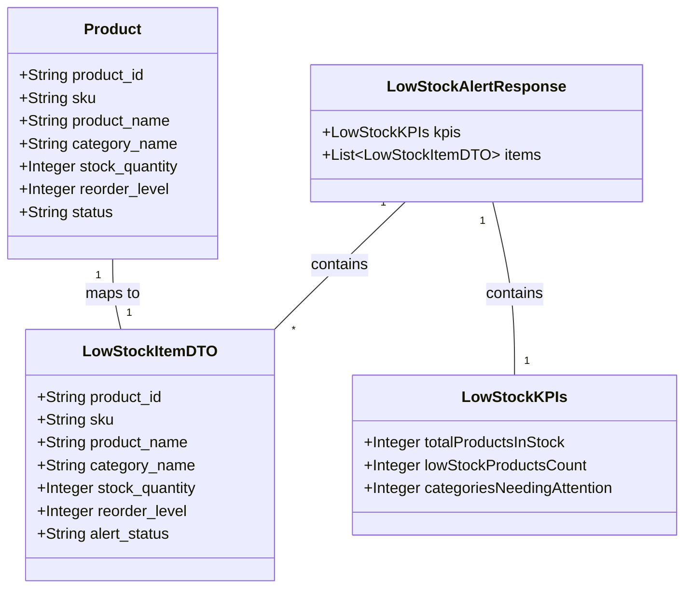

# Low Stock Alert Dashboard and API

## Requirements
Implement a Low Stock Alert feature that monitors inventory levels, generates summary KPIs (total stock, low stock items, categories needing attention), and identifies products that are below safety thresholds ("Sắp hết hàng" or "Rất nguy cấp") to enable timely restocking.

## Entities


## Approach
1. **API Design**:
   - Create `GET /api/inventory/low-stock-alerts` endpoint.
   - The endpoint queries the `products` table from Supabase.
   - Calculates KPI metrics and alert status on the backend to centralize business logic and minimize payload size.

2. **Technical Implementation**:
   - Backend: Express.js, Supabase JS SDK. Add method to `InventoryController`.
   - Frontend: React component `LowStockAlertDashboard` injected into `MainLayout` at route `/alerts`. Use `Sidebar` and `Topbar` routing conventions already present in `App.jsx`.

3. **Business Logic**:
   - "Rất nguy cấp": Triggered when `stock_quantity <= (0.2 * reorder_level)` OR `stock_quantity < 5`.
   - "Sắp hết hàng": Triggered when `stock_quantity < reorder_level` and condition for "Rất nguy cấp" is not met.
   - Items included in the detailed list are only those matching the low stock conditions above.
   - "Tổng sản phẩm trong kho": Sum of `stock_quantity` of all products in the database.
   - "Danh mục cần lưu ý": Count of unique `category_id` or `category_name` present in the low stock list.

## Structure

### Dependencies
1. `inventoryRoutes.js` calls `InventoryController.js`.
2. `InventoryController.js` depends on the Supabase client (`../config/supabase`).
3. React Route `/alerts` depends on `LowStockAlertDashboard.jsx`.

### Layered Architecture
1. Route Layer: `inventoryRoutes.js` exposes the REST API.
2. Controller Layer: `InventoryController.getLowStockAlerts` handles request, queries Supabase, applies business logic, and formats the response.
3. Frontend UI: `LowStockAlertDashboard.jsx` handles data fetching, rendering KPI cards using `StatCard`, and displaying the data table with status badges.

## Operations

### Create API Endpoint - getLowStockAlerts
1. **Responsibility**: Fetch all products, compute KPIs and statuses, and return `LowStockAlertResponse`.
2. **Logic**:
   - Query `product_id, sku, product_name, category_name, stock_quantity, reorder_level` from the `products` table using Supabase.
   - Initialize KPIs: `totalStock = 0`, `lowStockItems = []`, `uniqueCategories = new Set()`.
   - Loop through products:
     - Add `stock_quantity` to `totalStock`.
     - Validate if `reorder_level` is valid (not null/undefined, and > 0, otherwise default to a safe value or skip reorder logic unless stock is `< 5`).
     - Evaluate low stock condition: `isLowStock = stock_quantity < reorder_level || stock_quantity < 5`.
     - If `isLowStock`:
       - Determine status: If `stock_quantity <= (0.2 * reorder_level)` OR `stock_quantity < 5`, `alert_status = 'Rất nguy cấp'`. Else `alert_status = 'Sắp hết hàng'`.
       - Map to `LowStockItemDTO` and push to `lowStockItems`.
       - Add `category_name` to `uniqueCategories`.
   - Construct response:
     ```json
     {
       "success": true,
       "data": {
         "kpis": {
           "totalProductsInStock": totalStock,
           "lowStockProductsCount": lowStockItems.length,
           "categoriesNeedingAttention": uniqueCategories.size
         },
         "items": lowStockItems
       }
     }
     ```
   - Handle Supabase errors using `next(error)`.
3. **Target File**: `backend/src/controllers/InventoryController.js` (add method `getLowStockAlerts`).
4. **Update Route**: Add `router.get('/low-stock-alerts', InventoryController.getLowStockAlerts);` to `backend/src/routes/inventoryRoutes.js`.

### Implement Frontend Component - LowStockAlertDashboard
1. **Responsibility**: Display KPIs and a table of low stock items.
2. **Logic**:
   - Create `LowStockAlertDashboard.jsx` in `frontend/src/components/`.
   - Use `useState` for `alertsData` (defaulting to null or empty template) and `loading`.
   - Use `useEffect` to fetch data from `/api/inventory/low-stock-alerts` on mount.
   - Render 3 `StatCard` components using the KPI data (Total products, Low stock products, Categories needing attention).
   - Render a data table listing `items`.
   - Create a badge for `alert_status`. Style: red background (`bg-red-100 text-red-700`) for "Rất nguy cấp", warning/gray background (`bg-slate-200 text-slate-700`) for "Sắp hết hàng".
   - Include action buttons (e.g., "Tạo đơn nhập kho") - these can be placeholders for now.
3. **Target File**: `frontend/src/components/LowStockAlertDashboard.jsx` (New File).
4. **Update Routes**: In `frontend/src/App.jsx`, replace the placeholder `<Route path="/alerts" ...>` with `<Route path="/alerts" element={<LowStockAlertDashboard onNavigate={handleNavigate} />} />`. Import the new component.

## Norms
1. **Data Validation**: Validate that `stock_quantity` and `reorder_level` exist before calculating ratios to prevent division by zero or NaN.
2. **Exception Handling**: Use the existing Express error handling middleware (`next(error)`) in controllers.
3. **UI Styling**: Use Tailwind CSS matching the Figma specifications. Follow existing aesthetic patterns seen in `ProductDashboard.jsx`.
4. **Component Reuse**: Reuse `StatCard.jsx` and standard UI elements (icons from `lucide-react`).

## Safeguards
1. **Functional Constraints**: Must correctly flag items where stock is 0 or negative as "Rất nguy cấp".
2. **Error Handling Constraints**: API must return 500 status gracefully if the Supabase query fails, without crashing the Node.js process.
3. **UI Constraints**: The table must be responsive and scrollable if the list of low stock items exceeds viewport height. Ensure text color contrast on badges meets accessibility minimums.
