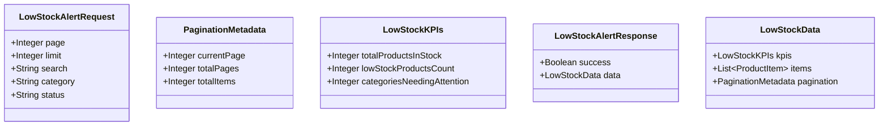

# SPDD: Pagination and Filter for Low Stock Alert

## Requirements
Cập nhật và bổ sung tính năng Phân trang, Lọc danh mục/trạng thái và Tìm kiếm cho trang Cảnh báo tồn kho.
- **Backend** xử lý thêm query parameters (`page`, `limit`, `search`, `category`, `status`) để lọc và phân trang dữ liệu.
- **API** trả về thêm metadata phân trang: `currentPage`, `totalPages`, `totalItems`.
- **Global KPIs**: Các thẻ KPI đầu trang (Tổng tồn kho, Số SP sắp hết hàng, Số danh mục cần lưu ý) phải được tính trên tổng dữ liệu hàng tồn thấp toàn cục, **không** bị ảnh hưởng bởi giới hạn phân trang `limit`.
- **Frontend** hiển thị thanh công cụ lọc/tìm kiếm ở trên bảng và các nút bấm phân trang (1, 2, 3...) ở chân bảng, tuân thủ đúng giao diện hiện tại.

## Entities

## Approach
- **Backend (`InventoryController.getLowStockAlerts`)**:
  - Đọc các query parameters: `page` (mặc định 1), `limit` (mặc định 5), `search`, `category`, `status`.
  - Fetch toàn bộ `products` từ Supabase để tính toán Alert Status ("Rất nguy cấp", "Sắp hết hàng").
  - Tính toán Global KPIs dựa trên toàn bộ dữ liệu hợp lệ (không bị cắt bởi pagination).
  - Thực hiện lọc mảng dữ liệu trong bộ nhớ (In-memory filtering) dựa trên `search` (theo tên/sku), `category` (theo danh mục), và `status` (theo Alert Status tính được).
  - Thực hiện cắt mảng (In-memory pagination) bằng `.slice()` theo `page` và `limit`.
  - Trả về JSON chứa `kpis`, `items`, và `pagination`.
- **Frontend (`LowStockAlertDashboard.jsx`)**:
  - Bổ sung các state: `page`, `searchTerm`, `selectedCategory`, `selectedStatus`.
  - Thêm Filter Bar (thanh tìm kiếm và dropdowns lọc) tương tự như ở trang `ProductDashboard`.
  - Thêm Pagination Footer hiển thị số thứ tự trang và các nút điều hướng (Trước / Sau, 1, 2, 3...).
  - Cập nhật hàm gọi API có truyền đầy đủ query params và xử lý response mới có chứa `pagination`.

## Structure
- `backend/src/controllers/InventoryController.js`: Chỉnh sửa logic hàm `getLowStockAlerts`.
- `frontend/src/components/LowStockAlertDashboard.jsx`: Cập nhật UI và logic gọi API.

## Operations
- **Task 1: Cập nhật Backend API**
  - Chỉnh sửa `InventoryController.js`, nhận `req.query`. Tính KPIs trên dữ liệu không phân trang. Lọc dữ liệu mảng dựa trên các tham số truyền vào. Phân trang bằng `Array.slice()`. Trả về dữ liệu chuẩn cấu trúc `kpis`, `items`, `pagination`.
- **Task 2: Cập nhật UI Filter/Search Frontend**
  - Thêm ô input Search, dropdown Danh mục, dropdown Trạng thái cảnh báo ("Rất nguy cấp", "Sắp hết hàng") vào `LowStockAlertDashboard.jsx`. Tích hợp logic debounce cho ô search (nếu cần).
- **Task 3: Cập nhật UI Pagination Frontend**
  - Hiển thị thông tin phân trang (Tổng số bản ghi, hiển thị từ...đến...) và nút điều hướng phân trang ở dưới cùng của bảng. Bấm trang nào gọi API load lại dữ liệu trang đó.

## Norms
- Khởi tạo giá trị mặc định cho phân trang (`page=1`, `limit=5`).
- Xử lý mượt mà việc thay đổi filter thì reset `page` về `1`.
- Giao diện bám sát các component sẵn có (input, select, button) kết hợp Tailwind CSS.

## Safeguards
- Khi page truyền vào vượt quá `totalPages`, tự động điều chỉnh hiển thị hoặc fallback về trang hợp lệ.
- Tính trạng In-memory filtering có thể bị nghẽn nếu dữ liệu quá lớn, nhưng do yêu cầu tính Status động nên đây là phương pháp phù hợp nhất và an toàn nhất hiện tại mà không phải viết thêm RPC/View dưới DB.
