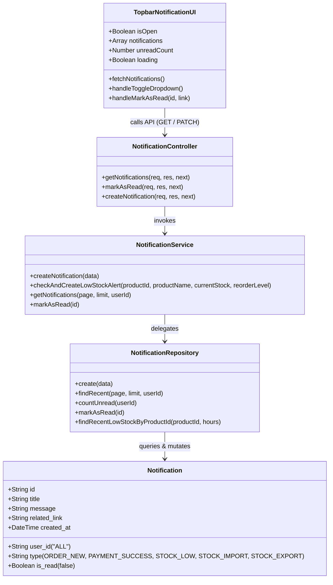

# Xây dựng chức năng Thông báo (Notification System)

## Requirements
Xây dựng và tích hợp trọn vẹn chức năng Thông báo (Notification) theo kiến trúc nhiều lớp (`Layered Architecture`) từ Database (Supabase PostgreSQL), Backend (Node.js/Express) cho đến Frontend UI (`Topbar.jsx` Dropdown Popover Menu). Hệ thống cần hỗ trợ tự động trigger tạo thông báo khi có đơn hàng mới (`ORDER_NEW`), thanh toán thành công (`PAYMENT_SUCCESS`), biến động nhập/xuất kho (`STOCK_IMPORT`, `STOCK_EXPORT`), và cảnh báo tồn kho an toàn (`STOCK_LOW`), kèm cơ chế chống spam (cooldown 24h cho cảnh báo tồn kho) và cơ chế Polling (30s) kết hợp Event-driven Re-fetch trên Frontend để cập nhật Dynamic Unread Badge Counter cùng khả năng điều hướng nhanh (`useNavigate`) đến đúng trang liên quan.

## Entities


## Approach
1. **DB Setup (`database/schema.sql` & Supabase)**:
   - Khởi tạo bảng `notifications` với khóa chính `id` (VARCHAR(50)), trường `user_id` mặc định là `'ALL'` để toàn bộ quản trị viên/nhân viên đều nhận được các thông báo vận hành trọng yếu.
   - Thêm các chỉ mục (`INDEX`) trên `user_id`, `is_read` và `created_at DESC` để tối ưu hóa tốc độ truy vấn danh sách thông báo và đếm số lượng chưa đọc (`unread count`).
2. **Backend Layered Architecture & Logic Chống Spam (`NotificationService`)**:
   - Xây dựng chuẩn mực theo 3 lớp: `NotificationRepository` (giao tiếp trực tiếp Supabase qua `@supabase/supabase-js`), `NotificationService` (chứa logic nghiệp vụ và điều phối), và `NotificationController` (bắt HTTP request, trả về JSON chuẩn hóa).
   - Thiết kế các endpoints: `GET /api/notifications` (danh sách thông báo phân trang + `unreadCount`), `PATCH /api/notifications/:id/read` (đánh dấu đã đọc), và `POST /api/notifications` (API hỗ trợ tạo thông báo hoặc test nội bộ).
   - **Logic Chống Spam (`STOCK_LOW` Cooldown 24h)**: Trong `NotificationService.checkAndCreateLowStockAlert()`, trước khi ghi nhận thông báo sắp hết hàng cho một sản phẩm, hệ thống gọi `NotificationRepository.findRecentLowStockByProductId(productId, 24)` để kiểm tra trong 24 giờ qua đã có thông báo `STOCK_LOW` nào (chưa đọc hoặc đã gửi) cho `product_id` này chưa. Nếu đã có, hệ thống sẽ bỏ qua (`skip`) không tạo thêm bản ghi mới, ngăn chặn tuyệt đối tình trạng admin bị "dội bom" thông báo mỗi khi bán đi 1 sản phẩm của mặt hàng đang tồn thấp.
3. **Frontend Integration & Polling Mechanism (`Topbar.jsx`)**:
   - Nâng cấp trực tiếp component `frontend/src/components/Topbar.jsx` (nơi đang chứa icon chuông tĩnh).
   - **Cơ chế Polling 30s**: Sử dụng `useEffect` khởi tạo một `setInterval` gọi `GET /api/notifications?page=1&limit=15` định kỳ mỗi 30 giây thông qua Axios client (`frontend/src/services/api.js`). Đồng thời hỗ trợ **Event-driven Re-fetch** (lắng nghe custom event hoặc gọi `fetchNotifications()` ngay sau các thao tác mua/bán hàng) để đảm bảo dữ liệu luôn tươi mới mà không phá vỡ kiến trúc Frontend -> Express -> Supabase hiện có.
   - **Dynamic Unread Badge Counter**: Hiển thị số lượng chưa đọc ngay góc trên icon chuông (`span.bg-red-500`). Nếu `unreadCount === 0`, tự động ẩn badge. Nếu `unreadCount > 99`, hiển thị `99+`.
   - **Dropdown Popover Menu UI/UX**: Render một popover tuyệt đẹp chuẩn Tailwind CSS (`absolute right-0 mt-2 w-80 md:w-96 bg-white rounded-xl shadow-2xl border border-slate-100 z-50`). Có đầy đủ:
     - *Header*: Tiêu đề "Thông báo mới" kèm trạng thái tải (`loading`).
     - *Notification List*: Phân loại bằng màu sắc/icon theo `type` (`ORDER_NEW`: Xanh dương, `PAYMENT_SUCCESS`: Xanh lá, `STOCK_LOW`: Đỏ/Cam, `STOCK_IMPORT`/`STOCK_EXPORT`: Tím/Amber). Các mục chưa đọc (`!is_read`) được làm nổi bật với nền xanh nhạt (`bg-blue-50/60`) và chấm xanh (`w-2 h-2 bg-blue-600 rounded-full`).
     - *Empty State*: Nếu không có thông báo, hiển thị illustration/icon "Không có thông báo nào" thanh lịch.
     - *Interactive Navigation (`useNavigate` & Optimistic Update)*: Khi click vào thông báo, lập tức cập nhật giao diện (`unreadCount - 1`, `is_read = true`), gọi background API `PATCH /api/notifications/:id/read`, và điều hướng `navigate(notification.related_link)` đến trang tương ứng (`/sales`, `/alerts`, `/inventory-ops`).

## Structure
### Dependencies & Layering
1. **Routes Layer (`backend/src/routes/notificationRoutes.js`)**:
   - `GET /` -> `NotificationController.getNotifications`
   - `PATCH /:id/read` -> `NotificationController.markAsRead`
   - `POST /` -> `NotificationController.createNotification`
   - Đăng ký vào `backend/src/index.js` qua `app.use('/api/notifications', notificationRoutes);`
2. **Controllers Layer (`backend/src/controllers/NotificationController.js`)**:
   - Nhận `req.query` (`page`, `limit`), `req.params` (`id`), `req.body` (`title`, `message`, `type`, `related_link`). Gọi sang `NotificationService`.
3. **Services Layer (`backend/src/services/NotificationService.js`)**:
   - Chứa logic nghiệp vụ cốt lõi, tích hợp bộ đệm kiểm tra cooldown 24h đối với loại `STOCK_LOW`.
   - Export các hàm `createNotification(data)` và `checkAndCreateLowStockAlert(productId, productName, currentStock, reorderLevel)` để các service/controller khác (`OrderService.js`, `InventoryController.js`) dễ dàng inject và gọi.
4. **Repositories Layer (`backend/src/repositories/notificationRepository.js`)**:
   - Giao tiếp trực tiếp với Supabase client (`../config/supabase`). Thực thi các truy vấn `select`, `insert`, `update` (`is_read = true`), và đếm tổng `count`.

### API Specification
- **`GET /api/notifications`**
  - *Query Params*: `page` (number, default: 1), `limit` (number, default: 15), `user_id` (string, default: 'ALL').
  - *Response*:
    ```json
    {
      "success": true,
      "data": {
        "items": [
          {
            "id": "NOTI-1720684000000",
            "user_id": "ALL",
            "title": "Đơn hàng mới DH123456",
            "message": "Khách hàng Nguyễn Văn A vừa đặt đơn hàng trị giá 2.500.000đ",
            "type": "ORDER_NEW",
            "is_read": false,
            "related_link": "/sales",
            "created_at": "2026-07-11T16:30:00.000Z"
          }
        ],
        "unreadCount": 3,
        "pagination": {
          "currentPage": 1,
          "totalPages": 5,
          "totalItems": 72
        }
      }
    }
    ```
- **`PATCH /api/notifications/:id/read`**
  - *Response*: `{ "success": true, "message": "Notification marked as read" }`

## Operations

### DB Setup - SQL Script for `notifications` table
1. **Target File**: `database/schema.sql` (bổ sung vào cuối file hoặc chạy trên Supabase SQL Editor).
2. **SQL DDL**:
   ```sql
   CREATE TABLE IF NOT EXISTS public.notifications (
       id VARCHAR(50) PRIMARY KEY,
       user_id VARCHAR(50) NOT NULL DEFAULT 'ALL',
       title VARCHAR(255) NOT NULL,
       message TEXT NOT NULL,
       type VARCHAR(50) NOT NULL CHECK (type IN ('ORDER_NEW', 'PAYMENT_SUCCESS', 'STOCK_LOW', 'STOCK_IMPORT', 'STOCK_EXPORT')),
       is_read BOOLEAN NOT NULL DEFAULT FALSE,
       related_link VARCHAR(255),
       created_at TIMESTAMP WITH TIME ZONE DEFAULT CURRENT_TIMESTAMP
   );

   CREATE INDEX IF NOT EXISTS idx_notifications_user_id ON public.notifications(user_id);
   CREATE INDEX IF NOT EXISTS idx_notifications_is_read ON public.notifications(is_read);
   CREATE INDEX IF NOT EXISTS idx_notifications_created_at ON public.notifications(created_at DESC);
   CREATE INDEX IF NOT EXISTS idx_notifications_type_created ON public.notifications(type, created_at DESC);
   ```

### Create Repository - `backend/src/repositories/notificationRepository.js`
1. **Responsibility**: Chịu trách nhiệm toàn bộ các thao tác truy vấn và cập nhật bảng `notifications` trên Supabase.
2. **Methods**:
   - `create(data)`:
     ```javascript
     const supabase = require('../config/supabase');
     class NotificationRepository {
       async create(data) {
         const { data: result, error } = await supabase
           .from('notifications')
           .insert([data])
           .select()
           .single();
         if (error) throw error;
         return result;
       }
       async findRecent(page = 1, limit = 15, userId = 'ALL') {
         const offset = (page - 1) * limit;
         const { data, error, count } = await supabase
           .from('notifications')
           .select('*', { count: 'exact' })
           .or(`user_id.eq.${userId},user_id.eq.ALL`)
           .order('created_at', { ascending: false })
           .range(offset, offset + limit - 1);
         if (error) throw error;
         return { items: data || [], totalItems: count || 0 };
       }
       async countUnread(userId = 'ALL') {
         const { count, error } = await supabase
           .from('notifications')
           .select('*', { count: 'exact', head: true })
           .or(`user_id.eq.${userId},user_id.eq.ALL`)
           .eq('is_read', false);
         if (error) throw error;
         return count || 0;
       }
       async markAsRead(id) {
         const { error } = await supabase
           .from('notifications')
           .update({ is_read: true })
           .eq('id', id);
         if (error) throw error;
         return true;
       }
       async findRecentLowStockByProductId(productId, hours = 24) {
         const cutoffTime = new Date(Date.now() - hours * 60 * 60 * 1000).toISOString();
         const { data, error } = await supabase
           .from('notifications')
           .select('id, created_at')
           .eq('type', 'STOCK_LOW')
           .ilike('message', `%(${productId})%`)
           .gte('created_at', cutoffTime)
           .limit(1);
         if (error) throw error;
         return data && data.length > 0 ? data[0] : null;
       }
     }
     module.exports = new NotificationRepository();
     ```

### Create Service - `backend/src/services/NotificationService.js`
1. **Responsibility**: Xử lý logic tạo thông báo, kiểm tra cooldown 24h chống spam, và tổng hợp dữ liệu danh sách cho controller.
2. **Methods**:
   - `createNotification(data)`:
     ```javascript
     const notificationRepository = require('../repositories/notificationRepository');
     class NotificationService {
       async createNotification({ user_id = 'ALL', title, message, type, related_link }) {
         const id = `NOTI-${Date.now()}-${Math.floor(Math.random() * 1000)}`;
         return await notificationRepository.create({
           id,
           user_id,
           title,
           message,
           type,
           is_read: false,
           related_link: related_link || '/'
         });
       }

       async checkAndCreateLowStockAlert(productId, productName, currentStock, reorderLevel) {
         // Logic Chống Spam: Kiểm tra trong 24h qua đã có thông báo STOCK_LOW nào cho productId này chưa
         const existingAlert = await notificationRepository.findRecentLowStockByProductId(productId, 24);
         if (existingAlert) {
           console.log(`[NotificationService] Skip low stock alert for ${productId}: Cooldown active (24h)`);
           return null;
         }

         const isCritical = currentStock === 0 || currentStock <= (0.2 * reorderLevel);
         const title = isCritical ? `[Nguy cấp] Hết/Sắp hết hàng: ${productName}` : `[Cảnh báo] Tồn kho thấp: ${productName}`;
         const message = `Sản phẩm ${productName} (${productId}) hiện chỉ còn ${currentStock} (Ngưỡng an toàn: ${reorderLevel}). Vui lòng lên kế hoạch nhập hàng ngay!`;

         return await this.createNotification({
           title,
           message,
           type: 'STOCK_LOW',
           related_link: '/alerts'
         });
       }

       async getNotifications(page = 1, limit = 15, userId = 'ALL') {
         const pageNum = Math.max(1, parseInt(page));
         const limitNum = Math.min(50, Math.max(1, parseInt(limit)));
         const { items, totalItems } = await notificationRepository.findRecent(pageNum, limitNum, userId);
         const unreadCount = await notificationRepository.countUnread(userId);
         const totalPages = Math.ceil(totalItems / limitNum) || 1;

         return {
           items,
           unreadCount,
           pagination: {
             currentPage: pageNum,
             limit: limitNum,
             totalItems,
             totalPages
           }
         };
       }

       async markAsRead(id) {
         return await notificationRepository.markAsRead(id);
       }
     }
     module.exports = new NotificationService();
     ```

### Create Controller & Routes - `backend/src/controllers/NotificationController.js` & `backend/src/routes/notificationRoutes.js`
1. **Controller (`NotificationController.js`)**:
   ```javascript
   const notificationService = require('../services/NotificationService');
   class NotificationController {
     async getNotifications(req, res, next) {
       try {
         const { page = 1, limit = 15, user_id = 'ALL' } = req.query;
         const result = await notificationService.getNotifications(page, limit, user_id);
         res.json({ success: true, data: result });
       } catch (error) { next(error); }
     }
     async markAsRead(req, res, next) {
       try {
         const { id } = req.params;
         await notificationService.markAsRead(id);
         res.json({ success: true, message: 'Marked as read' });
       } catch (error) { next(error); }
     }
     async createNotification(req, res, next) {
       try {
         const result = await notificationService.createNotification(req.body);
         res.status(201).json({ success: true, data: result });
       } catch (error) { next(error); }
     }
   }
   module.exports = new NotificationController();
   ```
2. **Routes (`notificationRoutes.js`)**:
   ```javascript
   const express = require('express');
   const router = express.Router();
   const notificationController = require('../controllers/NotificationController');

   router.get('/', notificationController.getNotifications);
   router.patch('/:id/read', notificationController.markAsRead);
   router.post('/', notificationController.createNotification);

   module.exports = router;
   ```
3. **Register in `backend/src/index.js`**:
   ```javascript
   const notificationRoutes = require('./routes/notificationRoutes');
   app.use('/api/notifications', notificationRoutes);
   ```

### Inject Triggers into Existing Backend Services (`OrderService.js` & `InventoryController.js`)
1. **In `backend/src/services/OrderService.js`**:
   - Add `const notificationService = require('./NotificationService');` at top.
   - Inside `createOrder(data)` upon inserting order items successfully (around line 116):
     ```javascript
     try {
       await notificationService.createNotification({
         title: `Đơn bán hàng mới ${order_code}`,
         message: `Đơn hàng ${order_code} trị giá ${data.total_amount?.toLocaleString('vi-VN')}đ đã được tạo bởi ${data.customer_name || 'Khách lẻ'}`,
         type: 'ORDER_NEW',
         related_link: '/sales'
       });
     } catch (notiErr) {
       console.error('Failed to create ORDER_NEW notification:', notiErr);
     }
     ```
   - Inside `processSuccessfulPayment(payosOrderCode)` upon changing status to `PAID` (around line 196):
     ```javascript
     try {
       await notificationService.createNotification({
         title: `Thanh toán thành công ${order.order_code}`,
         message: `Đơn hàng ${order.order_code} đã hoàn tất thanh toán trực tuyến qua PayOS`,
         type: 'PAYMENT_SUCCESS',
         related_link: '/sales'
       });
     } catch (notiErr) {
       console.error('Failed to create PAYMENT_SUCCESS notification:', notiErr);
     }
     ```
   - Inside `deductStockAndRecordMovements(order, items)` inside the loop right after `updateProductStock` (around line 152):
     ```javascript
     try {
       const pData = await orderRepository.getProductStock(item.product_id);
       if (pData && pData.stock_quantity <= pData.reorder_level) {
         await notificationService.checkAndCreateLowStockAlert(item.product_id, pData.product_name || item.product_id, pData.stock_quantity, pData.reorder_level);
       }
     } catch (lowErr) {
       console.error('Failed to check low stock alert in OrderService:', lowErr);
     }
     ```
2. **In `backend/src/controllers/InventoryController.js`**:
   - Add `const notificationService = require('../services/NotificationService');` at top.
   - Inside `createMovement(req, res, next)` inside the loop after updating stock (`products -> update({ stock_quantity: newStock })`, around line 40):
     ```javascript
     try {
       await notificationService.createNotification({
         title: type === 'IMPORT' ? `Nhập kho: ${p.product_name || item.product_id}` : `Xuất kho: ${p.product_name || item.product_id}`,
         message: `Đã ${type === 'IMPORT' ? 'nhập' : 'xuất'} số lượng ${item.quantity} cho mã ${item.product_id}. Tồn kho mới: ${newStock}`,
         type: type === 'IMPORT' ? 'STOCK_IMPORT' : 'STOCK_EXPORT',
         related_link: '/inventory-ops'
       });
       if (newStock <= (p.reorder_level || 10)) {
         await notificationService.checkAndCreateLowStockAlert(item.product_id, p.product_name || item.product_id, newStock, p.reorder_level || 10);
       }
     } catch (notiErr) {
       console.error('Failed to create notification inside InventoryController:', notiErr);
     }
     ```

### Update Component - `frontend/src/components/Topbar.jsx`
1. **Responsibility**: Quản lý state thông báo, polling định kỳ mỗi 30s, hiển thị Unread Badge Counter động, và render Dropdown Popover Menu chuẩn Tailwind CSS với khả năng điều hướng `useNavigate`.
2. **Implementation Details (`Topbar.jsx`)**:
   - *Imports needed*: `import React, { useState, useEffect, useRef } from 'react';` and `import { Search, Bell, Menu, LogOut, User, CheckCircle2, AlertTriangle, ArrowDownRight, ArrowUpRight, ShoppingBag, CheckCheck } from 'lucide-react';` plus `import api from '../services/api';`
   - *State Variables*:
     ```javascript
     const [isOpen, setIsOpen] = useState(false);
     const [notifications, setNotifications] = useState([]);
     const [unreadCount, setUnreadCount] = useState(0);
     const [loadingNoti, setLoadingNoti] = useState(false);
     const dropdownRef = useRef(null);
     ```
   - *Click Outside Handler*:
     ```javascript
     useEffect(() => {
       const handleClickOutside = (event) => {
         if (dropdownRef.current && !dropdownRef.current.contains(event.target)) {
           setIsOpen(false);
         }
       };
       document.addEventListener('mousedown', handleClickOutside);
       return () => document.removeEventListener('mousedown', handleClickOutside);
     }, []);
     ```
   - *Fetch & Polling Logic*:
     ```javascript
     const fetchNotifications = async (silent = false) => {
       if (!silent) setLoadingNoti(true);
       try {
         const res = await api.get('/notifications?page=1&limit=15');
         if (res.data && res.data.success) {
           setNotifications(res.data.data.items || []);
           setUnreadCount(res.data.data.unreadCount || 0);
         }
       } catch (err) {
         console.error('Failed to fetch notifications:', err);
       } finally {
         if (!silent) setLoadingNoti(false);
       }
     };

     useEffect(() => {
       fetchNotifications();
       const intervalId = setInterval(() => {
         fetchNotifications(true);
       }, 30000); // Polling mỗi 30s
       return () => clearInterval(intervalId);
     }, [location.pathname]); // Re-fetch khi user chuyển trang
     ```
   - *Mark As Read & Navigate Logic*:
     ```javascript
     const handleNotificationClick = async (noti) => {
       if (!noti.is_read) {
         // Optimistic update
         setNotifications(prev => prev.map(n => n.id === noti.id ? { ...n, is_read: true } : n));
         setUnreadCount(prev => Math.max(0, prev - 1));
         try {
           await api.patch(`/notifications/${noti.id}/read`);
         } catch (err) {
           console.error('Failed to mark notification read:', err);
         }
       }
       setIsOpen(false);
       if (noti.related_link) {
         navigate(noti.related_link);
       }
     };

     const handleMarkAllAsRead = async () => {
       setNotifications(prev => prev.map(n => ({ ...n, is_read: true })));
       setUnreadCount(0);
       try {
         // Cập nhật từng item chưa đọc hoặc gọi API batch nếu cần
         const unreadIds = notifications.filter(n => !n.is_read).map(n => n.id);
         for (const id of unreadIds) {
           await api.patch(`/notifications/${id}/read`);
         }
       } catch (err) {
         console.error('Failed to mark all as read:', err);
       }
     };
     ```
   - *Icon & Color Mapping Helper*:
     ```javascript
     const getNotiStyle = (type) => {
       switch (type) {
         case 'ORDER_NEW':
           return { bg: 'bg-blue-100 text-blue-600', icon: <ShoppingBag className="w-4 h-4" /> };
         case 'PAYMENT_SUCCESS':
           return { bg: 'bg-emerald-100 text-emerald-600', icon: <CheckCircle2 className="w-4 h-4" /> };
         case 'STOCK_LOW':
           return { bg: 'bg-rose-100 text-rose-600', icon: <AlertTriangle className="w-4 h-4" /> };
         case 'STOCK_IMPORT':
           return { bg: 'bg-amber-100 text-amber-600', icon: <ArrowDownRight className="w-4 h-4" /> };
         case 'STOCK_EXPORT':
           return { bg: 'bg-purple-100 text-purple-600', icon: <ArrowUpRight className="w-4 h-4" /> };
         default:
           return { bg: 'bg-slate-100 text-slate-600', icon: <Bell className="w-4 h-4" /> };
       }
     };
     ```
   - *Dropdown JSX Render*: Replace the static `<button className="relative p-2 ...">...` inside `Topbar.jsx` with:
     ```jsx
     <div className="relative" ref={dropdownRef}>
       <button 
         onClick={() => setIsOpen(!isOpen)}
         className="relative p-2 text-slate-500 hover:bg-slate-50 rounded-full transition-colors focus:outline-none"
         title="Thông báo hệ thống"
       >
         <Bell className="w-5 h-5" />
         {unreadCount > 0 && (
           <span className="absolute -top-1 -right-1 min-w-[18px] h-[18px] px-1 bg-red-500 text-white font-bold text-[10px] flex items-center justify-center rounded-full border border-white animate-pulse">
             {unreadCount > 99 ? '99+' : unreadCount}
           </span>
         )}
       </button>

       {isOpen && (
         <div className="absolute right-0 mt-2 w-80 sm:w-96 bg-white rounded-xl shadow-2xl border border-slate-200 z-50 overflow-hidden animate-in fade-in slide-in-from-top-2 duration-200">
           {/* Dropdown Header */}
           <div className="px-4 py-3 bg-slate-50 border-b border-slate-100 flex items-center justify-between">
             <div className="flex items-center gap-2">
               <h3 className="font-semibold text-slate-900 text-sm">Thông báo mới</h3>
               {unreadCount > 0 && (
                 <span className="px-2 py-0.5 bg-blue-100 text-blue-700 text-xs font-semibold rounded-full">
                   {unreadCount} chưa đọc
                 </span>
               )}
             </div>
             {unreadCount > 0 && (
               <button 
                 onClick={handleMarkAllAsRead}
                 className="text-xs text-blue-600 hover:text-blue-800 font-medium flex items-center gap-1 transition-colors"
               >
                 <CheckCheck className="w-3.5 h-3.5" />
                 Đánh dấu tất cả
               </button>
             )}
           </div>

           {/* Dropdown List */}
           <div className="max-h-96 overflow-y-auto divide-y divide-slate-100">
             {loadingNoti && notifications.length === 0 ? (
               <div className="py-8 text-center text-slate-400 text-sm">Đang tải thông báo...</div>
             ) : notifications.length === 0 ? (
               <div className="py-10 flex flex-col items-center justify-center text-slate-400">
                 <Bell className="w-10 h-10 text-slate-200 mb-2 stroke-1" />
                 <p className="text-sm font-medium text-slate-500">Không có thông báo nào</p>
                 <p className="text-xs text-slate-400 mt-0.5">Hệ thống đang hoạt động ổn định</p>
               </div>
             ) : (
               notifications.map((noti) => {
                 const style = getNotiStyle(noti.type);
                 return (
                   <div 
                     key={noti.id}
                     onClick={() => handleNotificationClick(noti)}
                     className={`p-3.5 flex items-start gap-3 cursor-pointer transition-colors hover:bg-slate-50 ${
                       !noti.is_read ? 'bg-blue-50/50 font-medium' : ''
                     }`}
                   >
                     <div className={`w-8 h-8 rounded-full flex-shrink-0 flex items-center justify-center mt-0.5 ${style.bg}`}>
                       {style.icon}
                     </div>
                     <div className="flex-1 min-w-0">
                       <div className="flex items-center justify-between gap-2 mb-0.5">
                         <h4 className={`text-xs ${!noti.is_read ? 'font-bold text-slate-900' : 'font-semibold text-slate-700'} truncate`}>
                           {noti.title}
                         </h4>
                         <span className="text-[10px] text-slate-400 flex-shrink-0">
                           {new Date(noti.created_at).toLocaleTimeString('vi-VN', { hour: '2-digit', minute: '2-digit' })}
                         </span>
                       </div>
                       <p className="text-xs text-slate-600 line-clamp-2 leading-relaxed font-normal">
                         {noti.message}
                       </p>
                     </div>
                     {!noti.is_read && (
                       <span className="w-2 h-2 rounded-full bg-blue-600 flex-shrink-0 mt-1.5" />
                     )}
                   </div>
                 );
               })
             )}
           </div>

           {/* Dropdown Footer */}
           <div className="px-4 py-2.5 bg-slate-50 border-t border-slate-100 text-center">
             <span className="text-[11px] text-slate-400">
               Cập nhật tự động mỗi 30 giây • <strong className="text-slate-600 font-medium">Smart Retail AI</strong>
             </span>
           </div>
         </div>
       )}
     </div>
     ```

## Norms
1. **API Data Contracts**:
   - Tất cả các API thông báo trả về định dạng chuẩn: `{ success: true, data: { items: [...], unreadCount: Number, pagination: { currentPage, limit, totalItems, totalPages } } }`.
2. **Naming & Identifiers**:
   - Khóa chính `id` được sinh với prefix `NOTI-` kèm timestamp `Date.now()`.
   - Các trường cơ sở dữ liệu tuân thủ kiểu `snake_case` (`user_id`, `is_read`, `related_link`, `created_at`). Các biến trong Javascript sử dụng `camelCase` hoặc mapping trực tiếp từ DB field names.
3. **UI Theme & Accessibility**:
   - Dropdown menu sử dụng bảng màu nhạt (`bg-white`, `border-slate-200`, text `slate-900`/`slate-600`), độ tương phản cao, hỗ trợ scroll bar nhạt (`overflow-y-auto`) và hiệu ứng chuyển động mượt mà (`animate-in fade-in slide-in-from-top-2`).

## Safeguards
1. **Zero Breaking Changes**: Xử lý tạo thông báo trong `OrderService.js` và `InventoryController.js` phải được bao bọc trong khối `try { ... } catch (err) { ... }` và **không được `throw err`** nếu ghi thông báo thất bại. Điều này đảm bảo rằng ngay cả khi bảng `notifications` gặp sự cố mạng hoặc lỗi DB, luồng tạo đơn hàng, trừ kho, thanh toán của khách hàng **vẫn phải diễn ra bình thường 100%**.
2. **Cooldown Verification**: Luôn gọi `NotificationRepository.findRecentLowStockByProductId(productId, 24)` trước khi insert thông báo `STOCK_LOW` mới. Không được bỏ qua bước check này trong `NotificationService`.
3. **Graceful Navigation Handling**: Trang đích của `related_link` (`/sales`, `/alerts`, `/inventory-ops`) phải là các route hợp lệ đã được định nghĩa trong `App.jsx`.
4. **Optimistic UI Reliability**: Cập nhật `is_read = true` trên state Frontend ngay lập tức khi user click, đảm bảo độ phản hồi tức thì dưới 10ms mà không phải chờ đợi network delay.
