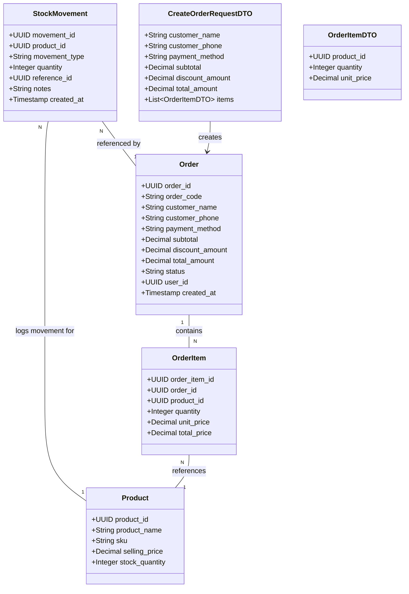

# Implement Sales Transaction and Inventory Management API

## Requirements
Implement a reliable Point-of-Sale (POS) transaction processing system that atomically creates orders, records order items, deducts product stock, and logs stock movements.

## Entities

## Approach
1. API Design:
   - Provide a RESTful endpoint `POST /api/orders` to handle the checkout process.
   - Accept a single complex payload containing order details and the list of order items.

2. Technical Implementation:
   - Use Supabase/PostgreSQL for data persistence.
   - Utilize a Database Transaction (e.g., Supabase RPC function or backend explicit transaction) to ensure atomicity.
   - All inserts/updates must happen within the same transaction to prevent partial state updates (e.g., order created but stock not updated).

3. Business Logic:
   - Validate that `order_items` is not empty.
   - For each item, verify `stock_quantity >= item.quantity`. If any item fails, rollback and return an error.
   - Insert the `orders` record.
   - Insert `order_items`.
   - Update `products` to decrease `stock_quantity`.
   - Insert `stock_movements` with type `OUT` and referencing the `order_id`.

## Structure

### Dependencies
1. `OrderController` depends on `OrderService`.
2. `OrderService` depends on `SupabaseClient` for transaction management and database interactions.

### Layered Architecture
1. Controller Layer: `OrderController` - validates incoming request format, calls service, returns HTTP response.
2. Service Layer: `OrderService` - contains core business logic, validation of business rules (stock check), orchestrates the database transaction.
3. Data Access Layer: Handled via `SupabaseClient` (or specific Repositories if applicable).

## Operations

### Implement Service Layer - OrderService
1. Interface Definition: `createOrder(request: CreateOrderRequestDTO)`
2. Core Methods: `createOrder`
   - Input Validation: Check if `items` array is empty. Throw `ValidationException` if empty.
   - Business Logic:
     - Begin Database Transaction.
     - Fetch current stock for all `product_id`s in `items`.
     - Check stock constraints (`currentStock >= requestedQuantity`). Throw `BusinessException` if insufficient stock.
     - Insert `orders` record with `status = 'COMPLETED'`.
     - Get generated `order_id`.
     - Insert into `order_items`.
     - Update `products.stock_quantity`.
     - Insert into `stock_movements`.
     - Commit transaction.
   - Exception Handling: Catch all errors, rollback transaction, throw standard exceptions.

## Norms
1. Data Validation: Validate payload at the controller level using a schema validator (e.g., Zod or Joi).
2. Transaction Management: Database transaction must strictly encompass all four DB operations (insert orders, insert items, update stock, insert movements).
3. Exception Handling: Business exceptions must contain explicit error codes (e.g., `INSUFFICIENT_STOCK`, `EMPTY_ORDER_ITEMS`).

## Safeguards
1. Business Rule Constraints:
   - The `order_items` array MUST NOT be empty.
   - MUST check `stock_quantity` condition before proceeding with any insertion.
   - The entire action sequence (insert orders, insert order_items, update stock_quantity, insert stock_movements) MUST be executed in a single Database Transaction.
2. Data Constraints:
   - Stock quantity cannot drop below 0.
3. Integration Constraints:
   - Handle concurrent requests properly. Database-level constraints or row locks (e.g., `SELECT FOR UPDATE`) might be needed for stock check.
