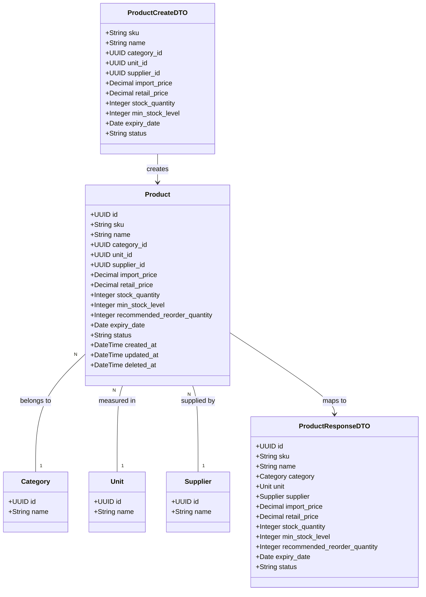

# Implement Product Management Module

## Requirements
Implement a full-stack product management module supporting CRUD operations, advanced search/filtering, pagination, and inventory alerts while enforcing business constraints such as valid pricing, SKU uniqueness, and non-negative stock levels.

## Entities

## Approach
1. System Architecture:
   - Client-Server Architecture utilizing a React SPA for the frontend and a Node.js/Express backend.
   - Database interaction managed via Supabase Client (PostgreSQL).
   - Soft deletion strategy (`deleted_at` timestamp) to maintain relational integrity with future sales and inventory modules.
2. Technical Implementation:
   - Backend: Express router, Supabase JavaScript SDK for data access, request validation middleware (Zod/Joi).
   - Frontend: React components, Tailwind CSS for styling (dashboard aesthetic), Lucide React for icons.
   - Integration: REST APIs communicating via JSON. Server-side pagination and filtering applied to the list endpoint.
3. Business Logic:
   - Import price must not exceed retail price.
   - Stock quantity cannot be negative.
   - Low stock state determined dynamically (`stock_quantity` <= `min_stock_level`).

## Structure

### Inheritance Relationships
1. `BusinessException` extends `Error` class for domain-specific errors.
2. `ValidationException` extends `Error` class for bad requests.

### Dependencies
1. `ProductController` injects `ProductService`.
2. `ProductService` injects `ProductRepository`.
3. `ProductRepository` depends on `SupabaseClient`.
4. React `ProductList` component calls backend APIs via `ProductApiService`.

### Layered Architecture
1. Route Layer: Define endpoint paths and attach validation middleware.
2. Controller Layer: Extract request parameters (query, body), invoke service methods, format HTTP responses.
3. Service Layer: Apply business rules (price constraints, SKU uniqueness), orchestration.
4. Repository Layer: Execute Supabase queries (select, insert, update, soft delete).
5. Exception Handling Layer: Unified error response formatting via Express error middleware (`GlobalExceptionHandler`).

## Operations

### DB Setup - Supabase Schema
1. Responsibility: Create tables and relationships in Supabase.
2. Methods/Scripts:
   - Create tables: `categories`, `units`, `suppliers` (id, name).
   - Create table: `products` with all fields and foreign keys.
   - Apply check constraints: `import_price <= retail_price`, `stock_quantity >= 0`.
   - Apply unique constraint on `sku`.

### Implement Backend - GlobalExceptionHandler
1. Responsibility: Unified handling of global exceptions in Express.
2. Exception Types:
   - `BusinessException`: Business logic violations (e.g., price invalid).
   - `ValidationException`: Input validation errors.
3. Response Format: Unified error structure `{ "success": false, "error": { "code": "...", "message": "..." } }`.

### Implement Backend - ProductRepository
1. Responsibility: Data access for products using Supabase SDK.
2. Core Methods:
   - `findAndCountAll(filters, page, limit)`: Returns paginated products joined with category, unit, supplier names. Filters by `deleted_at IS NULL`.
   - `findById(id)`: Returns single product.
   - `create(productData)`: Inserts new record.
   - `update(id, productData)`: Updates existing record.
   - `softDelete(id)`: Sets `deleted_at = NOW()`.

### Implement Backend - ProductService
1. Responsibility: Apply business rules before DB operations.
2. Core Methods:
   - `createProduct(data)`: Validates price constraint (`import_price <= retail_price`). Checks SKU uniqueness via Repo.
   - `updateProduct(id, data)`: Validates price constraint.

### Implement Backend - ProductController & Routes
1. Responsibility: Handle HTTP requests and validations.
2. Core Methods:
   - `GET /api/products`: Parses query params for pagination and filters.
   - `GET /api/products/:id`
   - `POST /api/products`: Validates body.
   - `PUT /api/products/:id`: Validates body.
   - `DELETE /api/products/:id`

### Implement Frontend - UI Components
1. Responsibility: Render the Product Dashboard.
2. Components:
   - `ProductDashboard`: Main page holding state for filters, pagination.
   - `ProductTable`: Renders data, badges for status, highlights low stock rows (when `stock_quantity <= min_stock_level`).
   - `ProductFilterBar`: Search input for SKU/Name, dropdowns for category/supplier/status.
   - `ProductModal`/`ProductForm`: Form for create/update with client-side validation.
3. Integration: Connect frontend state to backend APIs using Axios or fetch.

## Norms
1. API Responses: Use a consistent wrapper: `{ "success": true, "data": ..., "meta": { "pagination": ... } }` for lists.
2. Soft Deletion: All read queries must explicitly exclude soft-deleted records (`deleted_at IS NULL`).
3. Data Validation: All incoming POST/PUT requests must be validated before reaching the Service layer.
4. Styling: Use Tailwind CSS utility classes. Avoid custom CSS files.
5. Error Handling: Frontend must display user-friendly toast/alert messages on API errors.

## Safeguards
1. Functional Constraints: Products cannot be hard-deleted from the database.
2. Business Rule Constraints: `import_price` must be `<= retail_price`.
3. Business Rule Constraints: `stock_quantity` must be `>= 0`.
4. Integrity Constraints: Cannot create a product with a non-existent `category_id`, `unit_id`, or `supplier_id`.
5. Unique Constraints: `sku` must be globally unique across non-deleted products.
6. Exception Handling Constraints: Backend must not leak database error details (e.g., raw SQL errors) to the client.
