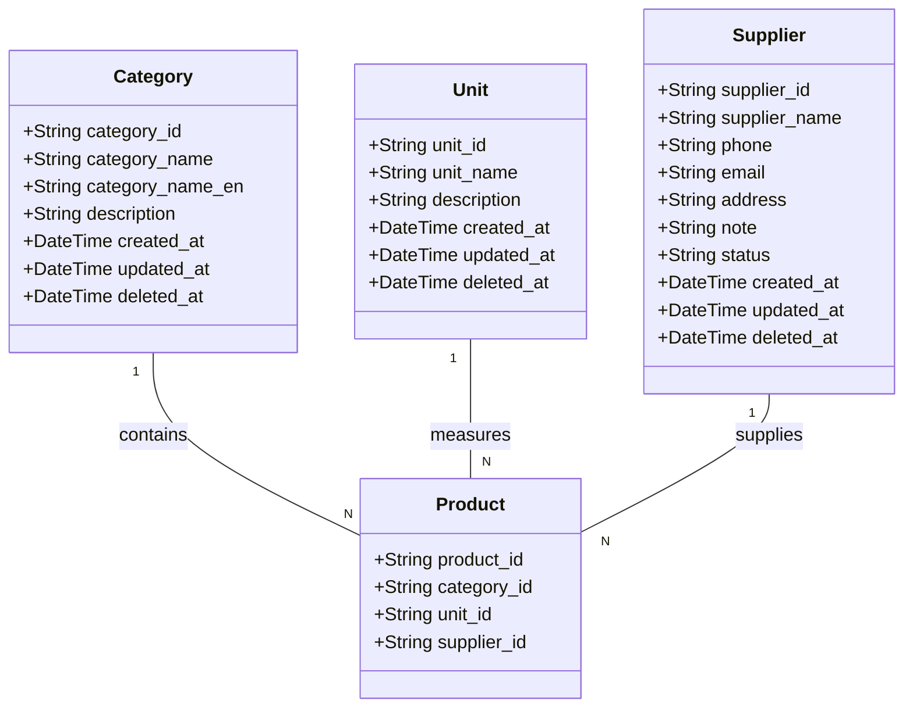

# Fullstack Master Data Management (Categories, Units, Suppliers)

## Requirements
Implement Master Data Management (MDM) functionalities for Categories, Units, and Suppliers across both backend and frontend, providing full CRUD capabilities with soft deletion, referential integrity safeguards against Product usage, and UI dashboards consistent with the established design system.

## Entities

## Approach
1. Backend API Design:
   - Implement standardized CRUD operations for `categories`, `units`, and `suppliers` using the existing 4-tier architecture (`Routes` -> `Controllers` -> `Services` -> `Repositories`).
   - Use `deleted_at` timestamps for soft deletion; explicitly filter out deleted records in all read queries.
2. Business Logic & Validation:
   - Services must verify no active or inactive `products` depend on a category/unit/supplier before allowing soft deletion.
   - Use Zod schemas in controllers to validate required fields and data types before processing.
   - Services must handle Supabase constraint violations (e.g., unique `category_name`, unique `supplier.email`) by mapping them to clean `BusinessException`s.
3. Frontend Architecture:
   - Implement simple state-based routing (`activePage`) in `App.jsx` to navigate between the existing `ProductDashboard` and the newly created `CategoryDashboard`, `UnitDashboard`, and `SupplierDashboard`.
   - Reuse the `MainLayout`, `Topbar`, and `Sidebar` components, updating `Sidebar` to dispatch navigation events.
   - Standardize table displays, pagination, and filter bars across all dashboards using the styling patterns established in `ProductDashboard.jsx`.

## Structure

### Dependencies
1. Controllers inject Services.
2. Services inject their respective Repositories, and potentially `ProductRepository` to check for referential constraints during deletion.

### Layered Architecture
1. Route Layer: Defines REST endpoints and binds Controller methods.
2. Controller Layer: Extracts request parameters, executes Zod validation, and formats standardized JSON responses.
3. Service Layer: Contains core business logic, including deduplication checks, referential integrity checks prior to deletion, and entity updates.
4. Repository Layer: Interfaces directly with the Supabase JS client for querying and mutating the database.
5. Exception Handling Layer: Relies on `GlobalExceptionHandler` to intercept and format `BusinessException` and `ValidationException`.

## Operations

### Create Backend Repositories
1. Create `CategoryRepository.js`, `UnitRepository.js`, `SupplierRepository.js` in `backend/src/repositories/`.
2. Implement standard methods: `findAndCountAll(filters, page, limit)`, `findById(id)`, `create(data)`, `update(id, data)`, `softDelete(id)`.
3. In `findAndCountAll`, ensure `is('deleted_at', null)` is always appended.
4. Ensure primary keys match DB columns exactly (`category_id`, `unit_id`, `supplier_id`). For ID generation on creation, use auto-generated logic or rely on Supabase defaults if defined, or generate application-side prefix IDs (e.g., `CAT-xxx`) if not auto-generated by the database.

### Create Backend Services
1. Create `CategoryService.js`, `UnitService.js`, `SupplierService.js` in `backend/src/services/`.
2. Implement CRUD wrappers.
3. **Delete Logic**: In `deleteCategory(id)` (and similarly for units/suppliers):
   - Check if category exists.
   - Query `ProductRepository.findAndCountAll({ category_id: id })`. If `count > 0`, throw `BusinessException('IN_USE', 'Cannot delete because it is being used by products')`.
   - Call repository `softDelete(id)`.
4. **Uniqueness Handling**: Catch Postgres unique constraint errors (code `23505` or similar) during `create` and `update`, and throw `BusinessException('DUPLICATE_NAME', 'Name already exists')`. (Note: Suppliers uniquely use `email`, treat empty strings as `null` before inserting).

### Create Backend Controllers and Routes
1. Create `CategoryController.js`, `UnitController.js`, `SupplierController.js`.
2. Define Zod schemas (e.g., `categorySchema = z.object({ category_id: z.string().optional(), category_name: z.string().min(1), ... })`).
3. Wire controllers to `categoryRoutes.js`, `unitRoutes.js`, `supplierRoutes.js`.
4. Register the new routes in `backend/server.js` (`app.use('/api/categories', categoryRoutes)`, etc.).

### Implement Frontend State Routing
1. Update `App.jsx` to hold `const [activePage, setActivePage] = useState('dashboard')`.
2. Update `Sidebar.jsx` to accept `activePage` and `setActivePage` as props, highlighting the active menu item and updating state onClick.
3. Render components dynamically in `App.jsx` based on `activePage` (`products` -> `ProductDashboard`, `categories` -> `CategoryDashboard`, etc.).

### Implement Frontend Dashboards
1. Create `frontend/src/services/categoryService.js`, `unitService.js`, `supplierService.js` implementing Axios GET/POST/PUT/DELETE wrappers.
2. Create `CategoryDashboard.jsx`, `UnitDashboard.jsx`, `SupplierDashboard.jsx`.
3. Replicate the styling of `ProductDashboard.jsx`: Include standard page headers, search bars, and tables.
4. Map correct fields to table columns (e.g., Category: ID, Tên, Tiếng Anh, Mô tả; Supplier: ID, Tên, SĐT, Email, Trạng thái).
5. Add UI placeholders (View/Edit/Delete buttons) for future modal integration.

## Norms
1. Response Format: All APIs must return `{ success: true, data: [payload], meta?: { pagination } }`.
2. Exception Handling: Business violations must throw `BusinessException` to be caught by the global handler, returning HTTP 400.
3. Soft Deletion: Never execute physical `DELETE` queries. Always `UPDATE` setting `deleted_at` to the current ISO string.
4. ID Consistency: Maintain usage of exact column names (`category_id`, `unit_id`, `supplier_id`) mapping to REST parameters (`/:id`).

## Safeguards
1. Referential Constraint: Do not allow soft deletion of a master data entity if it is referenced by ANY product in the `products` table.
2. Uniqueness Constraint: The backend must explicitly handle and cleanly report duplicate entity names or emails to the user, masking underlying database error codes.
3. Empty Email Constraint: For Suppliers, an empty email string `""` from the frontend must be converted to `null` or omitted before sending to Supabase to avoid triggering false unique constraint violations.
