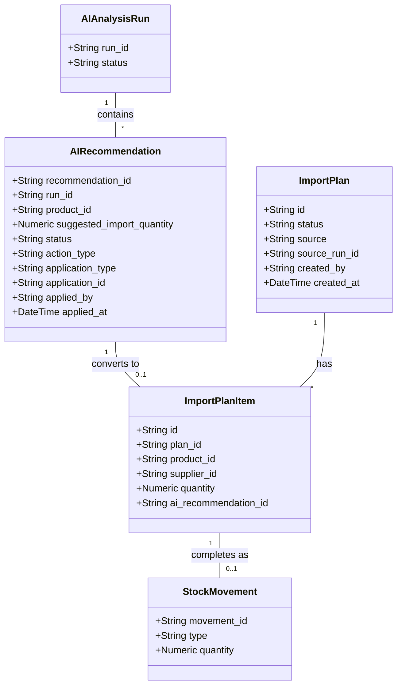

# Apply AI Recommendations to Import Drafts

## Requirements
Implement the capability to convert AI inventory recommendations into actionable Import Drafts without modifying actual stock quantities, ensuring single-direction status progression, preventing duplicate applications, and providing traceability from AI generation through draft creation to actual stock movement.

## Entities

## Approach
1. Database Expansion:
   - Extend `ai_recommendations` table with tracking fields (`action_type`, `applied_by`, `applied_at`, `application_type`, `application_id`).
   - Create new `import_plans` and `import_plan_items` tables to securely store drafts decoupled from actual `stock_movements`.
2. API & Transaction Strategy:
   - Provide REST APIs for single (`/:id/apply`) and bulk (`/apply-bulk`) application.
   - Use atomic conditional updates in Supabase (e.g., `update ... where status = 'PENDING'`) to handle race conditions and guarantee that each recommendation is only applied once.
3. User Experience & Navigation:
   - In the frontend, introduce a ConfirmDialog before making API calls.
   - Update UI buttons based on the live `status` (Pending -> Applying -> Applied -> Completed).
   - "Bulk Apply" only filters recommendations with `action_type = 'REORDER_STOCK'` and `status = 'PENDING'`, converting them into a single ImportPlan.
   - Clicking "Xem phiếu" on applied recommendations navigates the user to the Inventory Operations page pre-filled with the drafted plan items.

## Structure

### Dependencies
1. `AIController` depends on `AIInsightService` for applying recommendations.
2. `AIInsightService` depends on `AIRepository` for applying and `InventoryRepository` (or `ImportPlanRepository`) to create drafts.
3. `InventoryOpsDashboard` component calls `InventoryService` to load the drafted `ImportPlan` by ID.

### Layered Architecture
1. Controller Layer: Handles HTTP requests, enforces permissions, and returns unified API responses.
2. Service Layer: Enforces the business rules (preventing completed drafts from reverting, grouping bulk applications into one plan).
3. Repository Layer: Executes raw Supabase queries and handles transaction integrity via PostgreSQL functions if necessary.

## Operations

### Create DB Migration - `us-37_ai_recommendation_apply.sql`
1. Responsibility: Prepare DB schema for drafts and traceability.
2. Logic:
   - Add columns to `ai_recommendations`: `action_type` (TEXT), `applied_by` (TEXT), `applied_at` (TIMESTAMPTZ), `application_type` (TEXT), `application_id` (TEXT).
   - Create `import_plans` table: `id`, `status` (DRAFT, COMPLETED, CANCELLED), `source` (AI), `source_run_id`, `created_by`, `created_at`, `updated_at`.
   - Create `import_plan_items` table: `id`, `plan_id`, `product_id`, `supplier_id`, `quantity`, `ai_recommendation_id`.

### Implement Service - `AIInsightService`
1. Interface Definition: Add `applyRecommendation(id, userId)` and `applyBulkRecommendations(runId, userId)`.
2. Core Methods:
   - `applyRecommendation`:
     - Validate if `recommendation.status === 'PENDING'` & `action_type === 'REORDER_STOCK'`.
     - Create a single `ImportPlan` and one `ImportPlanItem`.
     - Update `ai_recommendations` status to `APPLIED` with references.
     - Return the `ImportPlan` ID.
   - `applyBulkRecommendations`:
     - Fetch all `PENDING` recommendations for the given `runId` with `action_type = 'REORDER_STOCK'`.
     - Create one `ImportPlan`.
     - Create multiple `ImportPlanItem`s.
     - Update all corresponding `ai_recommendations` to `APPLIED`.

### Implement Frontend - `AIInsightsPage.jsx`
1. Responsibility: Handle UX for applying recommendations.
2. Logic:
   - Build a ConfirmDialog for single and bulk actions.
   - Modify the Action button in the product table based on `status`.
   - Send `POST` to backend APIs upon confirmation.
   - Show Toast upon success and update the UI locally to `APPLIED`.
   - Change button to "Đã áp dụng", clicking it navigates to `/inventory-ops?planId={plan.id}`.

### Implement Frontend - `InventoryOpsDashboard.jsx`
1. Responsibility: Load and execute Drafts.
2. Logic:
   - If `planId` exists in query params, fetch the `import_plan_items`.
   - Pre-fill the import form with products and quantities from the plan.
   - Allow users to modify quantities.
   - When confirmed, submit as normal `IMPORT` stock movement.
   - After success, backend must update the `import_plans` to `COMPLETED` and related `ai_recommendations` to `COMPLETED`.

## Norms
1. API Responses: Return `{ success: true, message: '...', data: ... }` format.
2. Database Transactions: Use Supabase `.rpc()` if atomic multi-table inserts/updates are required to avoid race conditions.

## Safeguards
1. Business Rule Constraints:
   - Never directly modify `products.stock_quantity` when applying a recommendation.
   - Only recommendations with `action_type = 'REORDER_STOCK'` can be applied into drafts.
   - `COMPLETED` recommendations cannot be rolled back to `PENDING`.
2. Integration Constraints: 
   - Operations must authenticate the user via JWT and extract `user.id` to set `applied_by` and `created_by`.
3. Concurrency Constraints: 
   - The update to `ai_recommendations.status` must include a condition `WHERE status = 'PENDING'` to safely prevent double-click race conditions.
